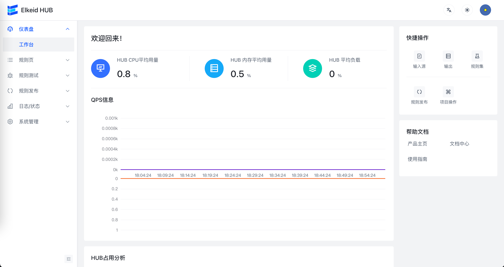
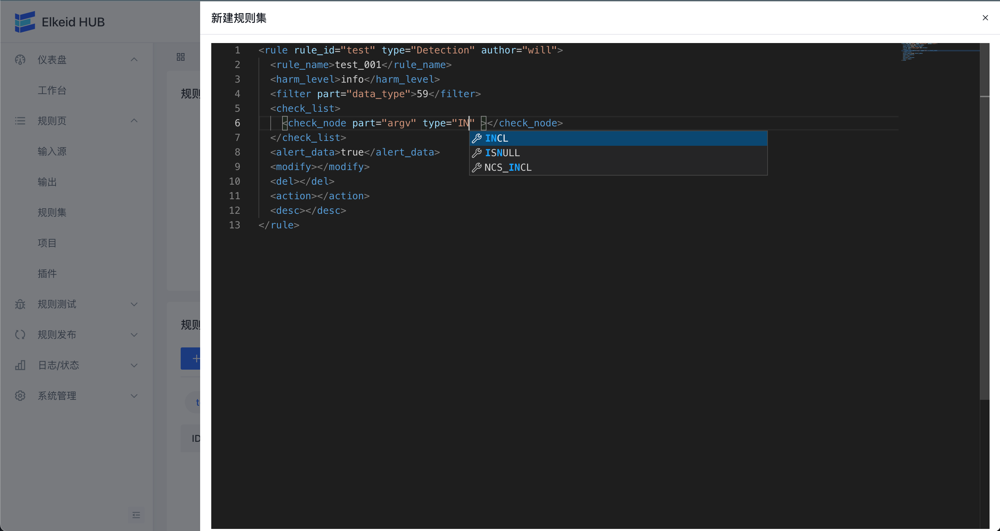
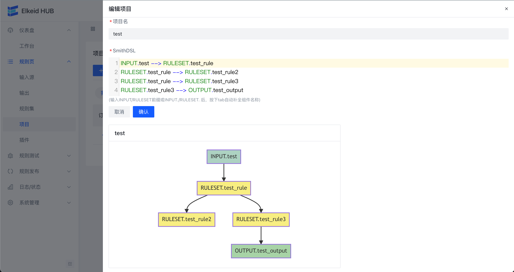
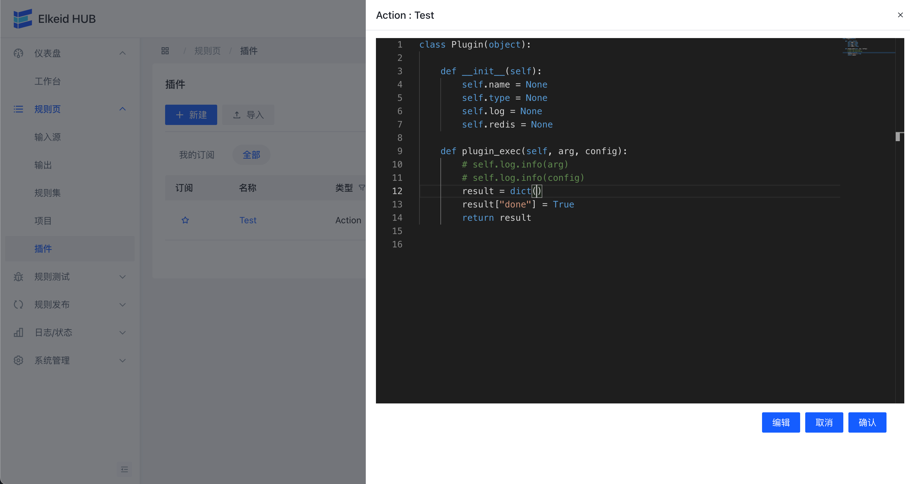

[English](README.md) | 简体中文
# Elkeid HUB
Elkeid HUB 是一款由 Elkeid Team 维护的规则/事件处理引擎，支持流式/离线(社区版尚未支持)数据处理。 初衷是通过标准化的抽象语法/规则来解决复杂的数据/事件处理与外部系统联动需求。

## Core Components
* `INPUT` 数据输入层，社区版仅支持Kafka
* `RULEENGINE/RULESET` 对数据进行检测/外部数据联动/数据处理的核心组件
* `OUTPUT` 数据输出层，社区版仅支持Kafka/ES
* `SMITH_DSL` 用来描述数据流转关系

## Application Scenarios

* Simple HIDS

* IDS Like Scenarios

* Multiple input and output scenarios

## Advantages
* 高性能
* 依赖极少
* 支持复杂数据处理
* 插件支持
* 支持有状态逻辑
* 支持外部系统/数据联动

## Elkeid Internal Best Practices
* 使用 Elkeid HUB 处理 Elkeid HIDS/RASP/Sandbox/K8s auditing 等原始数据，TPS 1.2亿条+/秒，HUB 调度实例 6000+

## Elkeid-HUB Function List

| Ability List     | Elkeid Community Edition | Elkeid Enterprise Edition |
| ---------------- | ------------------------ | ------------------------- |
| 流式数据处理     | :white_check_mark:       | :white_check_mark:        |
| 数据输入输出能力 | :white_check_mark:       | :white_check_mark:        |
| 完整前端支持     | :white_check_mark:       | :white_check_mark:        |
| 监控能力         | :white_check_mark:       | :white_check_mark:        |
| 插件支持         | :white_check_mark:       | :white_check_mark:        |
| Debug支持        | :white_check_mark:       | :white_check_mark:        |
| 离线数据处理     | :ng_man: | :white_check_mark:        |
| 持久化能力       | :ng_man: | :white_check_mark:        |
| Workspace        | :ng_man: | :white_check_mark:        |
| 集群模式         | :ng_man: | :white_check_mark:        |
| 在线升级策略     | :ng_man: | :white_check_mark:        |

## Front-end Display (Community Edition)

**Overview**

**Edit Rule**

**Edit HUB Project**

**Edit HUB Python Plugin**

**Submission Rules**

## Getting Started
- [Deploy By Elkeidup](https://github.com/bytedance/Elkeid/blob/main/elkeidup/README-zh_CN.md#elkeid-hub-单独部署)
- [Elkeid HUB Quick Start](docs/quick_start/quick_start_zh-CN.md)

## Elkeid HUB Handbook
[Handbook](docs/handbook/handbook-zh_CN.md)

## Demo Config
[Demo](config/demo)

## Elkeid HIDS Rule and Project (Just Example)
[Elkeid Project](config/elkeid_hids)

(Need to use with [Elkeid](https://github.com/bytedance/Elkeid))

## LICENSE (Not Business Friendly)
[LICENSE](LICENSE)

## Contact us && Cooperation

