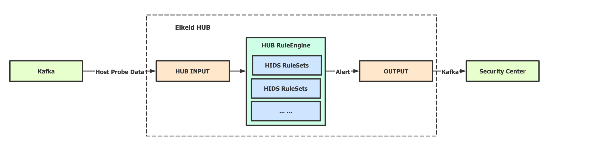
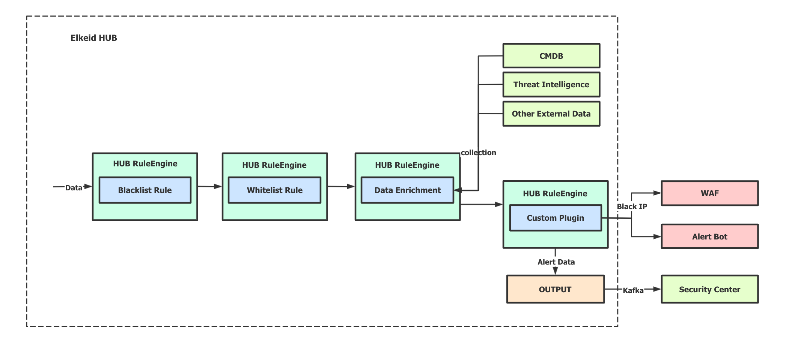
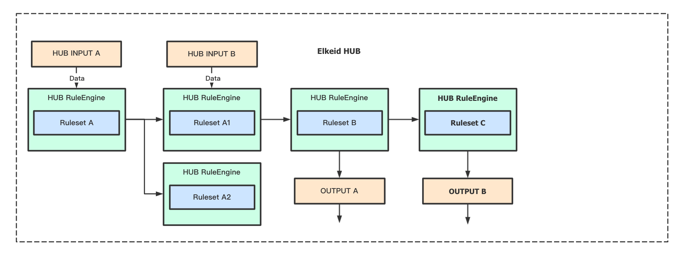
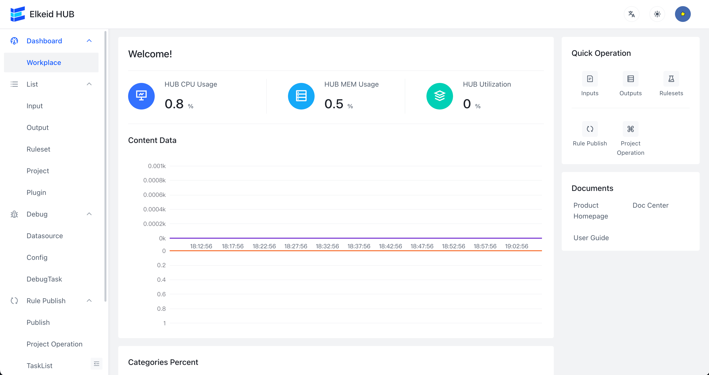
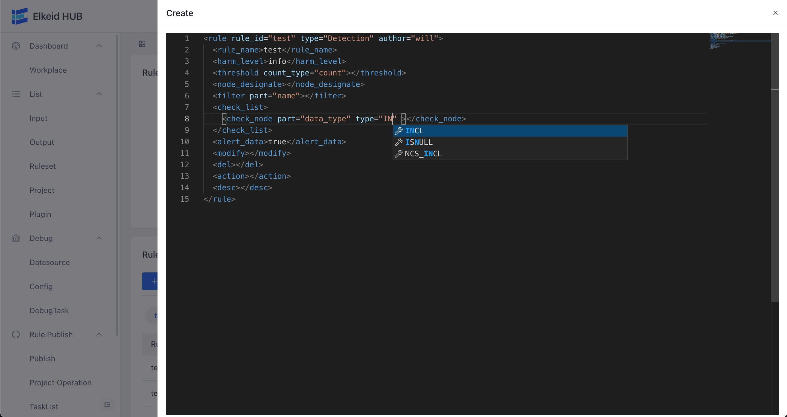
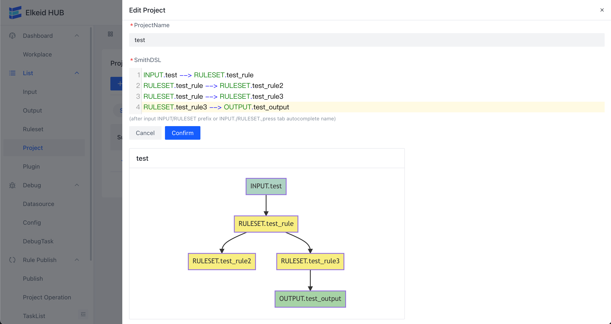
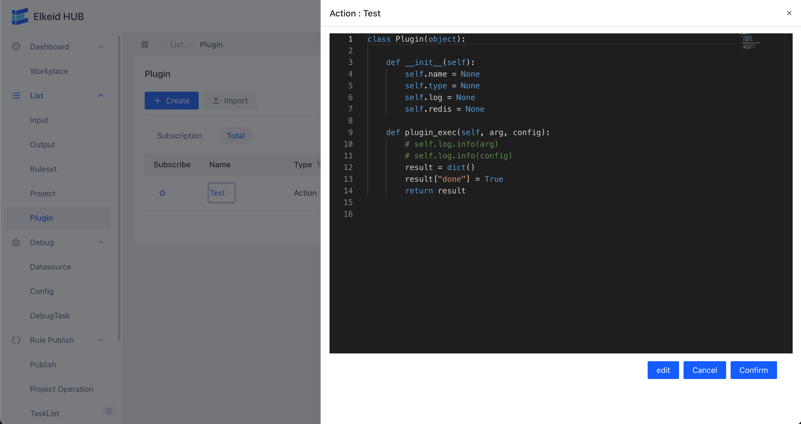
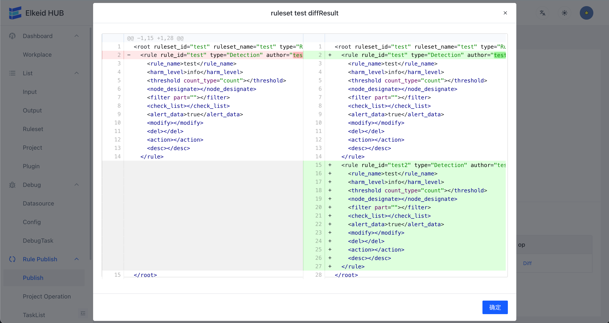

English | [简体中文](README-zh_CN.md)

# Elkeid HUB
Elkeid HUB is a rule/event processing engine maintained by the Elkeid Team that supports streaming/offline (not yet supported by the community edition) data processing. The original intention is to solve complex data/event processing and external system linkage requirements through standardized rules.

## Core Components
* `INPUT` data input layer, community edition only supports Kafka.
* `RULEENGINE/RULESET` core components for data detection/external data linkage/data processing.
* `OUTPUT` data output layer, community edition only supports Kafka/ES.
* `SMITH_DSL` used to describe the data flow relationship.

## Application Scenarios

* Simple HIDS

* IDS Like Scenarios

* Multiple input and output scenarios

## Advantage
* High Performance
* Very Few Dependencies
* Support Complex Data Processing
* Custom Plugin Support
* Support Stateful Logic Build
* Support External System/Data Linkage

## Elkeid Internal Best Practices
* Use Elkeid HUB to process Elkeid HIDS/RASP/Sandbox/K8s auditing etc. raw data, TPS 120+ million/s. HUB scheduling instance 6000+
* 99% alarm produce time is less than 0.5s
* Internal Maintenance Rules 2000+

## Elkeid-HUB Function List

| Ability List                  | Elkeid Community Edition | Elkeid Enterprise Edition |
| ----------------------------- | ------------------------ | ------------------------- |
| Streaming data processing     | :white_check_mark:       | :white_check_mark:        |
| Data input, output capability | :white_check_mark:       | :white_check_mark:        |
| Full frontend support         | :white_check_mark:       | :white_check_mark:        |
| Monitoring capability         | :white_check_mark:       | :white_check_mark:        |
| Plugin support                | :white_check_mark:       | :white_check_mark:        |
| Debug support                 | :white_check_mark:       | :white_check_mark:        |
| Offline data processing       | :ng_man:                 | :white_check_mark:        |
| Data Persistence capability   | :ng_man:                 | :white_check_mark:        |
| Workspace                     | :ng_man:                 | :white_check_mark:        |
| Cluster mode                  | :ng_man:                 | :white_check_mark:        |
| Online upgrade strategy       | :ng_man:                 | :white_check_mark:        |

## Front-end Display (Community Edition)

**Overview**

**Edit Rule**

**Edit HUB Project**

**Edit HUB Python Plugin**

**Submission Rules**

## Getting Started
- [Deploy By Elkeidup](https://github.com/bytedance/Elkeid/blob/main/elkeidup/README.md#elkeid-hub-deployment)
- [Elkeid HUB Quick Start](docs/quick_start/quick_start.md)

## Elkeid HUB Handbook (Chinese Version Only)
[Handbook](docs/handbook/handbook-zh_CN.md)

## Demo Config
[Demo](config/demo)

## Elkeid HIDS Rule and Project (Just Example)
[Elkeid Project](config/elkeid_hids)

(Need to use with [Elkeid](https://github.com/bytedance/Elkeid))

## LICENSE (Not Business Friendly)
[LICENSE](LICENSE)

## Contact us && Cooperation
