# Elkeid HUB 社区版使用指南

## 适用版本

Elkeid HUB 社区版

## 1 概述

Elkeid Hub 是为了解决各领域内的 **数据上报-实时流处理与事件处理** 中的 **实时处理** 的需求而诞生的产品，适用于如信息安全领域中的**入侵检测/事件处理与编排**等场景。

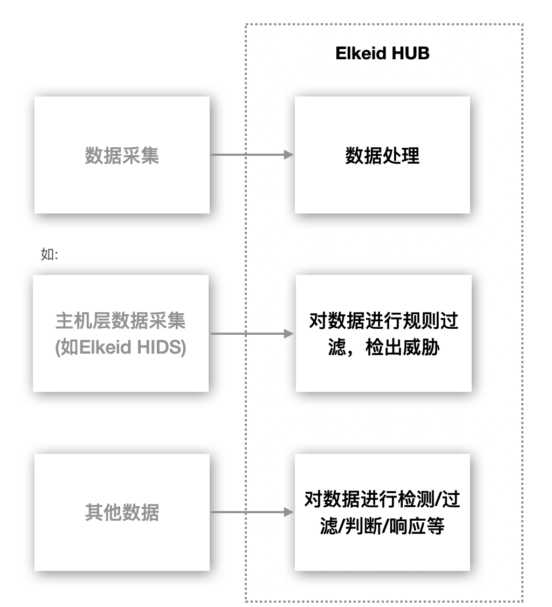

## 2 Elkeid HUB 优势

- **高性能**，且支持分布式横行扩展
- **策略编写简单易懂**，相关同学只需专注数据处理本身且学习成本很低
- **支持插件**，可以更好的处理复杂需求
- **部署简单**，依赖少

## 3 Elkeid HUB 组件概述

Elkeid HUB 组件主要分为一下几种：

- **Input**：数据通过Input组件消费后进入到Elkeid HUB，目前支持**Kafka**
- **Output**：数据通过Output组件将Elkeid HUB中流转的数据推送到HUB之外，目前支持**ES/Kafka**
- **RuleSet**：数据处理的核心逻辑将通过RuleSet编写，如**检测**(支持正则，多模匹配，频率等多种检测方式)/**白名单**/**调用Plugin**等
- **Plugin**：用户可以**自定义任意检测**/**响应逻辑**，来满足一些复杂场景的需求，如发送告警到钉钉/飞书；与CMDB联动进行数据补充；联动Redis进行一些缓存处理等。编写完成后可以在RuleSet中调用这些插件
- **Project**：通过Project来构建一组Elkeid HUB逻辑，通常是由一个Input+一个或多个RuleSet+一个或多个Output组成

## 4 Elkeid Input/输入源

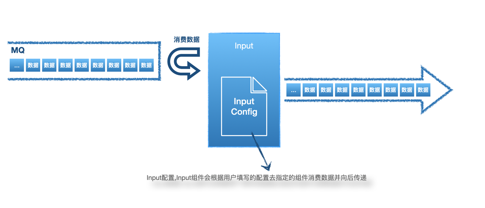

### 4.1 Input配置建议

- 输入源目前仅支持Kafka作为数据输入源，数据格式支持**Json**，**任意字符分割**的日志两种。
- 数据源类型建议:
  - **其他安全产品的告警日志**，HUB可以有效的对其进行二次处理，如联动其他基础组件做到对告警数据的缺失部分弥补，也可以通过自定义Action(规则引擎支持)来实现对告警进行自动化处理已完成告警-处置的闭环操作
  - **基础日志**，如HTTP镜像流量/Access日志/HIDS数据等。通过规则引擎，联动模块和异常检测模块对原始数据进行安全分析/入侵检测/自动化防御等操作
  - **审计日志**，如:登陆，原始的SQL请求，敏感操作等日志。HUB可以对其进行自定义的审计功能

### 4.2 Input配置说明

配置字段：

|字段|说明|
| :- | :- |
|InputID|不可重复，描述一个input，只能英文+"_/-"+数字组成|
|InputName|描述该input的name，可以重复，可以使用中文|
|InputType|目前只支持Kafka|
|DataType|json/protobuf/custom/grok|
|KafkaBootstrapServers|KafkaBootstrapServers，IP:PORT,使用,分割|
|KafkaGroupId|消费时使用的GroupID|
|KafkaOffsetReset|earliest或latest|
|KafkaCompression|kafka内数据压缩算法|
|KafkaWorkerSize|并发消费数|
|KafkaOtherConf|支持其他配置，具体配置见：https://github.com/edenhill/librdkafka/blob/master/CONFIGURATION.md|
|KafkaTopics|消费Topic，支持多Topic|
|GrokPattern|DataType为grok时有意义，数据会根据GrokPattern来解析并向后传递|
|DataPattern|DataType为custom时有意义，描述数据格式 |
|Separator|DataType为custom时有意义，分割数据所用符号|
*以上全部字段均为必填项*

配置举例(DataType: json):

```
InputID: wafdeny
InputName: wafdeny
InputType: kafka
DataType: json
TTL: 30
KafkaBootstrapServers: secmq1.xxx.com:9092,secmq2.xxx.com:9092,secmq3.xxx.com:9092,secmq4.xxx.com:9092
KafkaGroupId: smith-hub
KafkaOffsetReset: latest
KafkaCompression: none
KafkaWorkerSize: 3
KafkaOtherConf: ~

KafkaTopics:
  - wafdeny
  ```
## 5 Elkeid Output/输出

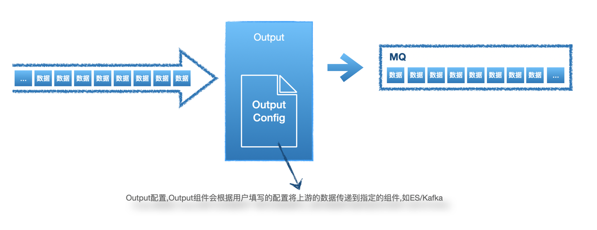

### 5.1 Output配置建议

> 目前默认HUB的默认策略报警不走Output，使用插件直接与Manager交互写入数据库，如果需要配置原始告警可以考虑配置Output

由于HUB是一款流数据处理工具，不具备存储能力，建议配置数据存储的输出源，如ES、Hadoop、SOC、SIEM等平台。目前支持的Output类型有：
- Kafka
- Elasticsearch

### 5.2 Output配置说明

配置字段：

|字段|说明|
| :- | :- |
|OutputID|不可重复，描述一个output，只能英文+"_/-"+数字组成|
|OutputName|描述该output的name，可以重复，可以使用中文|
|OutputType|es或kafka|
|AddTimestamp|true或false，开启后还在最终结果处新增timestamp字段并附上时间戳（如果已有该字段会覆盖）格式为：2021-07-05T11:48:14Z|
|KafkaBootstrapServers|OutputType为kafka时有意义|
|KafkaTopics|OutputType为kafka时有意义|
|KafkaOtherConf|OutputType为kafka时有意义|
|ESHost|OutputType为es时有意义，支持数组|
|ESIndex|OutputType为kafka时有意义|
配置举例(es):

```
OutputID: es_abnormal_dbcloud_task
OutputName: es_abnormal_dbcloud_task
OutputType: es
ESHost:
  - http://10.6.24.60:9200
ESIndex: abnormal_dbcloud_task
```

配置举例(kafka):

```
OutputID: dc_sqlhunter
OutputName: dc_sqlhunter
OutputType: kafka
KafkaBootstrapServers: 10.6.210.112:9092,10.6.210.113:9092,10.6.210.126:9092
KafkaTopics: mysqlaudit_alert
KafkaOtherConf: ~
```
## 6 Elkeid HUB RuleSet/规则集

RuleSet是HUB实现核心检测/响应动作的部分，需要根据具体业务需求来实现，下图是RuleSet在HUB中的简单工作流程：

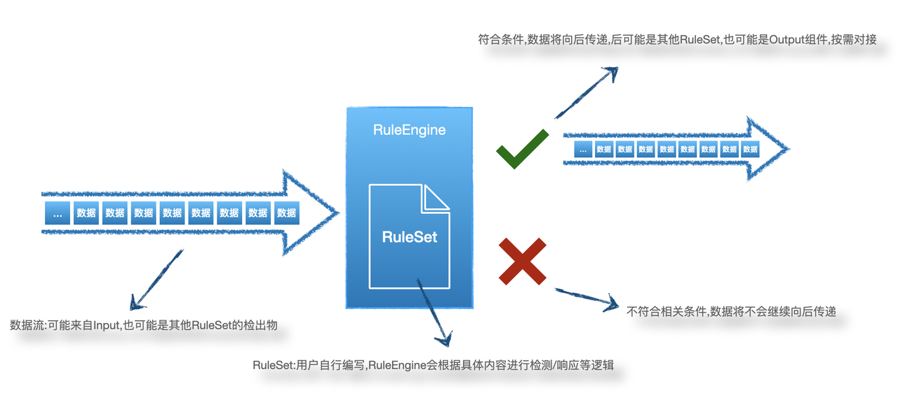

### 6.1 RuleSet

HUB RuleSet是通过XML来描述的规则集

RuleSet存在两种类型，**rule** 和 **whitelist**，如下：

```
<root ruleset_id="test1" ruleset_name="test1" type="C">
... ....
</root>
```


```
<root ruleset_id="test2" ruleset_name="test2" type="rule" undetected_discard="true">
... ...
</root>
```
其中RuleSet的<root></root>是固定的模式，不可随意变更，其他属性：

|字段|说明|
| :- | :- |
|ruleset_id|不可重复，描述一个ruleset，只能英文+"_/-"+数字组成|
|ruleset_name|描述该ruleset的name，可以重复，可以使用中文|
|type|为rule或者whitelist，其中rule代表着的检测到继续向后传递，whitelist则为检测到不向后传递；向后传递的概念可以简单的理解为该ruleset的检出事件|
|undetected_discard|仅在rule为rule时有意义，意为未检测到是否丢弃，若为true，则未被该ruleset检测到则丢弃，若为false，则为未被该rulset检测到也继续向后传递|
### 6.2 Rule

接下来我们来了解rule的具体语法，通常ruleset是由一个或多个rule组成的，需要注意的是多个rule之间的关系是'或'的关系，即如果一条数据可以命中其中的一条或多条rule。

```
<root ruleset_id="test2" ruleset_name="test2" type="rule" undetected_discard="true">

    <rule rule_id="rule_xxx_1" author="xxx" type="Detection">
        ... ...
    </rule>

    <rule rule_id="rule_xxx_2" author="xxx" type="Frequency">
        ... ...
    </rule>

</root>
```
一个rule的基本属性有：

|字段|说明|
| :- | :- |
|rule_id|在同一个ruleset中不可重复，标识一个rule|
|author|标识rule的作者|
|type|rule有两种类型，一种是Detection，是无状态的检测类型规则；另一种是Frequency，是在Detection的基础上对数据流进行频率的相关检测|

我们先来看两种不同类型规则的简单示例。

我们先假设从Input传入到Ruleset的数据样例为：

```
{
    "data_type":"59",
    "exe":"/usr/bin/nmap",
    "uid":"0"
}
```
#### 6.2.1 Detection 简单例子

```
<rule rule_id="detection_test_1" author="EBwill" type="Detection">
   <rule_name>detection_test_1</rule_name>
   <alert_data>True</alert_data>
   <harm_level>high</harm_level>
   <desc affected_target="test">这是一个Detection的测试</desc>
   <filter part="data_type">59</filter>
   <check_list>
       <check_node type="INCL" part="exe">nmap</check_node>
   </check_list>
</rule>
```
其中detection_test_1这个规则的意义是：当有数据的data_type为59，且exe中存在nmap的时候，数据继续向后传递。

#### 6.2.2 Frequency 简单例子

```
<rule rule_id="frequency_test_1" author="EBwill" type="Frequency">
   <rule_name> frequency_test_1 </rule_name>
   <alert_data>True</alert_data>
   <harm_level>high</harm_level>
   <desc affected_target="test">这是一个Frequency的测试</desc>
   <filter part="data_type">59</filter>
   <check_list>
       <check_node type="INCL" part="exe">nmap</check_node>
   </check_list>
   <node_designate>
       <node part="uid"/>
   </node_designate>
   <threshold range="30" local_cache="true">10</threshold>
</rule>
```
其中frequency_test_1这个规则的意义是：当有数据的data_type为59，且exe中存在nmap的时候，进入到频率检测：当同一个uid，在30秒内出现了 >= 10以上行为则告警，且在这过程中使用当前HUB实例自身缓存。

我们可以看到，实际上Frequency只是比Detection多了**node_designate以及threshold**字段，也就是说，无论什么规则，都会需有最基础的一些字段，我们接下来就先来了解这些通用的基础字段。

#### 6.2.3 通用字段描述

|字段|说明|
| :- | :- |
|rule_name|代表rule的名字，与rule_id不同的是可以使用中文或其他方式来更好的表达rule的含义，可以重复|
|alert_data|为True或False，如果为True，则会将该rule的基础信息增加到当前的数据中向后传递；若为False，则不会将该rule的信息增加到当前的数据中|
|harm_level|表达该rule的危险等级，可以为 info/low/a/high/critical|
|desc|用于提供这个rule本身的描述，其中affected_target是该rule针对的组件信息，用户自行填写，并无强制规定限制|
|<p>filter</p><p></p>|<p>对数据的第一层过滤，part表示对数据中的哪个字段进行过滤，具体内容为检测内容，义为part中是否存在 检测数据，如果RuleSet的类型为rule存在则继续向下执行rule的逻辑，如果不存在则不向下检测；RuleSet类型为whitelist时则相反，即存在则跳过检测，不存在则继续。</p><p>filter只能存在一个，且默认也仅支持“存在”的逻辑检测</p>|
|check_list|check_list内可以存在0或多个check_node，一个rule只能存在一个check_list，其中check_node的逻辑为'且'即为'and'，如果RuleSet的类型为rule则需要其中check_node全部通过才可以继续向下，如果为whitelist则相反，即其中check_node全部不通过才可以继续向下|
|check_node|check_node是一个具体的检测项|
#### 6.2.4 alert_data

我们依然以上面的Decetion的例子为例：

待检测数据：

```
{
    "data_type":"59",
    "exe":"/usr/bin/nmap",
    "uid":"0"
}
```

RuleSet：

```
<root ruleset_id="test2" ruleset_name="test2" type="rule" undetected_discard="true">
<rule rule_id="detection_test_1" author="EBwill" type="Detection">
   <rule_name>detection_test_1</rule_name>
   <alert_data>True</alert_data>
   <harm_level>high</harm_level>
   <desc affected_target="test">这是一个Detection的测试</desc>
   <filter part="data_type">59</filter>
   <check_list>
       <check_node type="INCL" part="exe">nmap</check_node>
   </check_list>
</rule>
</root>
```
如果其中**alert_data为True**，则该RuleSet会向后传递以下数据，会增加**SMITH_ALERT_DATA**字段，其中包括**HIT_DATA**用来描述命中规则的详情，以及**RULE_INFO**即规则本身的基本信息：

```
{
    "SMITH_ALERT_DATA":{
        "HIT_DATA":[
            "test2 exe:[INCL]: nmap"
        ],
        "RULE_INFO":{
            "AffectedTarget":"all",
            "Author":"EBwill",
            "Desc":"这是一个Detection的测试",
            "DesignateNode":null,
            "FreqCountField":"",
            "FreqCountType":"",
            "FreqHitReset":false,
            "FreqRange":0,
            "HarmLevel":"high",
            "RuleID":"test2",
            "RuleName":"detection_test_1",
            "RuleType":"Detection",
            "Threshold":""
        }
    },
    "data_type":"59",
    "exe":"/usr/bin/nmap",
    "uid":"0"
}
```
若**alert_data为False**，则会向后传递以下数据，即原始数据：

```
{
    "data_type":"59",
    "exe":"/usr/bin/nmap",
    "uid":"0"
}
```
#### 6.2.5 check_node

check_node的基本结构如下：

```
<check_node type="检测类型" part="待检测路径">
   检测内容
</check_node>
```

##### 6.2.5.1 检测类型

目前支持以下几种检测类型：

|类型|说明|
| :- | :- |
|END|待检测路径中的内容 以 检测内容 结尾|
|NCS_END|待检测路径中的内容 以 检测内容 结尾，大小写不敏感|
|START|待检测路径中的内容 以 检测内容 开头|
|NCS_START|待检测路径中的内容 以 检测内容 开头，大小写不敏感|
|NEND|待检测路径中的内容 不以 检测内容 结尾|
|NCS_NEND|待检测路径中的内容 不以 检测内容 结尾，大小写不敏感|
|NSTART|待检测路径中的内容 不以 检测内容 开头|
|NCS_NSTART|待检测路径中的内容 不以 检测内容 开头，大小写不敏感|
|INCL|待检测路径中的内容 存在 检测内容|
|NCS_INCL|待检测路径中的内容 存在 检测内容，大小写不敏感|
|NI|待检测路径中的内容 不存在 检测内容|
|NCS_NI|待检测路径中的内容 不存在 检测内容，大小写不敏感|
|MT|待检测路径中的内容 大于 检测内容|
|LT|待检测路径中的内容 小于 检测内容|
|REGEX|对 待检测路径中的内容 进行 检测内容 的正则匹配|
|ISNULL|待检测路径中的内容 为空|
|NOTNULL|待检测路径中的内容 不为空|
|EQU|待检测路径中的内容 等于 检测内容|
|NCS_EQU|待检测路径中的内容 等于 检测内容，大小写不敏感|
|NEQ|待检测路径中的内容 不等于 检测内容|
|NCS_NEQ|待检测路径中的内容 不等于 检测内容，大小写不敏感|
|CUSTOM|针对 待检测路径中的内容 进行 检测内容 指定的 自定义插件检测|
|CUSTOM_ALLDATA|针对  待检测数据 进行 检测内容 指定的 自定义插件检测；该方式下part可以为空，因为不依赖该字段，是将整个数据传递到插件进行检测|
我们接下来说明下part的使用方法，该方法与filter的part使用方法一致。

##### 6.2.5.2 part

假设待检测数据为：

```
{
    "data":{
        "name":"EBwill",
        "number":100,
        "list":[
            "a1",
            "a2"
        ]
    },
    "class.id":"E-19"
}
```
对应的part描述方式如下：

```
data               =       "{\"name\":\"EBwill\",\"number\":100,\"list\":[\"a1\",\"a2\"]
data.name          =       "EBwill"
data.number        =       "100"
data.list.#_0      =       "a1"
data.list.#_1      =       "a2"
class\.id          =       "E-19"
```
需要注意的是如果待检测key中存在"."需要用"\"转义

##### 6.2.5.3 高级用法之check_data_type

假设待检测数据为

```
{
    "stdin":"/dev/pts/1",
    "stdout":"/dev/pts/1"
}
```
假设我们需要检测 **stdin 等于 stdout**，即我们的检测内容来源于待检测数据，那么我们需要使用**check_data_type="from_ori_data" 来重新定义检测内容的来源是来自于待检测数据而不是填写的内容**，如下：

```
<check_node type="EQU" part="stdin" check_data_type="from_ori_data">stdout</check_node>
```
##### 6.2.5.4 高级用法之logic_type

假设待检测数据为

```
{
    "data":"test1 test2 test3",
    "size": 96,
}
```
当我们需要检测data中是否存在 test1 或 test2 的时候，我们可以写正则来实现，也可以通过定义**logic_type来实现check_node支持"AND"或者"OR"逻辑**，如下：

```
<!-- data中存在test1 或 test2 -->
<check_node type="INCL" part="data" logic_type="or" separator="|">
    <![CDATA[test1|test2]]>
</check_node>

<!-- data中存在test1 和 test2 -->
<check_node type="INCL" part="data" logic_type="and" separator="|">
    <![CDATA[test1|test2]]>
</check_node>
```
其中logic_type用来描述逻辑类型，支持"and"和"or"，separator用于自定义标识切割检测数据的方式

##### 6.2.5.5 高级用法之foreach

当我们需要对数组有较复杂的检测时可能可以通过foreach来解决。

假设待检测数据为

```
{
    "data_type":"12",
    "data":[
        {
            "name":"a",
            "id":"14"
        },
        {
            "name":"b",
            "id":"98"
        },
        {
            "name":"c",
            "id":"176"
        },
        {
            "name":"d",
            "id":"172"
        }
    ]
}
```
**我们想将id > 100且顶层的data_type等于12的数据的obj筛选出来**，那么可以先通过foreach进行遍历，然后再对遍历后的数据进行判断，如下：

```
<check_list foreach="d in data">
    <check_node type="MT" part="d.id">100</check_node>
    <check_node type="EQU" part="data_type">12</check_node>
</check_list>
```
则会向后传递多条数据：

```
{
    "data_type":"12",
    "data":[
        {
            "name":"c",
            "id":"176"
        }
    ]
}

以及

{
    "data_type":"12",
    "data":[
        {
            "name":"d",
            "id":"172"
        }
    ]
}
```
我们通过下图来更好的理解foreach这个高级用法


假设待检测数据为

```
{
    "data_type":"12",
    "data":[
        1,
        2,
        3,
        4,
        5,
        6,
        7
    ]
}
```

我们想筛选出data中小于5的数据，那么需要这样编写：

```
<check_list foreach="d in data">
    <check_node type="LT" part="d">5</check_node>
</check_list>
```

##### 6.2.5.6 高级用法之cep

默认情况下，checknode之间的关系and，满足所有checknode的检测条件时，数据才会检出，当需要自定义checknode之间的关系时，可以使用cep来解决。

假设待检测数据为

```
{
    "data_type":"12",
    "comm":"ETNET",
    "node_name":"p23",
    "exe":"bash",
    "argv":"bash"
}
```
我们希望将**node_name等于p23或comm等于ETNET，且exe 和 argv 等于bash** ，这样的数据过滤出来，如下：

```
<check_list cep="(a or b) and c">
    <check_node part="comm" group="a" type="INCL" check_data_type="static">ETNET</check_node>
    <check_node part="nodename" group="b" type="INCL" check_data_type="static">p23</check_node>
    <check_node part="exe" group="c" type="INCL" check_data_type="static">bash</check_node>
    <check_node part="argv" group="c" type="INCL" check_data_type="static">bash</check_node>
</check_list>
```
可以为check_node声明为group ，再在cep中编写对group的条件。支持**or** 和 **and**。

#### 6.2.6 Frequency 字段

Frequency的逻辑在check_list之后，但数据通过了filter和check_list之后，如果当前rule的类型为Frequency则会进入到Frequency的特殊检测逻辑。Frequency存在两个字段，**node_designate**与**threshold**，如下：

```
<node_designate>
    <node part="uid"/>
    <node part="pid"/>
</node_designate>
<threshold range="30">5</threshold>
```

##### 6.2.6.1 node_designate

其中**node_designate**是代表**group_by**，上方样例的含义是对 uid 和 pid 这两个字段进行group_by。

##### 6.2.6.2 threshold

**threshold是描述频率检测的具体检测内容：多长时间内(range)出现多少次(threshold)。**如上样例中即表达：同一uid与pid在30秒内出现5次即为检出，其中range的单位是秒。


如上图，由于仅仅在10s内就出现了5次，那么在剩下的20s内出现的全部pid=10且uid=1的数据都会告警，如下：


但是这个问题可能会导致告警数据过多，因此支持一个叫做：**hit_reset**的参数，使用方式如下：

```
<node_designate>
    <node part="uid"/>
    <node part="pid"/>
</node_designate>
<threshold range="30" hit_reset="true" >5</threshold>
```
当hit_reset为true时，每次满足threshold策略后，时间窗口将会重制，如下：


在频率检测的场景中，还有一种问题是性能问题，由于这种有状态的检测需要保存一些中间状态，这部分中间状态的数据我们是存在redis中，但是如果数据量过大，对redis会有一定的影响，因此我们频率检测也支持使用使用HUB自己的Local Cache来存储这些中间状态的数据，但是也会失去全局性，开启的方式是设置**local_cache参数为true**：

```
<node_designate>
    <node part="uid"/>
    <node part="pid"/>
</node_designate>
<threshold range="30" local_cache="true" hit_reset="true" >5</threshold>
```
失去全局性的原因是该Cache只服务于所属的HUB实例，如果是集群模式下，Local Cache并不互相共享，但是会带来一定的性能提升。

##### 6.2.6.3 高级用法之count_type

有些情况下我们计算频率不是想计算“出现了多少次”，而会有一些其他的需求，**如出现了多少类**，**出现的字段内数据和是多少。**我们先来看第一个需求，出现了多少类。

假设待检测数据为

```
{
    "sip":"10.1.1.1",
    "sport":"6637",
    "dip":"10.2.2.2",
    "dport":"22"
}
```
当我们想写一个检测扫描器的规则时，我们其实往往不关心某一个IP访问了多少次其他资产，而是访问了多少不同的其他资产，当这个数据较大时，可能存在网络扫描探测的可能性，假设我们规定，**3600秒内，同一IP访问的不同IP数超过100种就记录下来**，那么他的频率部分规则应该这样编写：

```
<node_designate>
    <node part="sip"/>
</node_designate>
<threshold range="3600" count_type="classify" count_field="dip">100</threshold>
```
这时候**count_type**需要为**classify**，**count_field**则为类型计算依赖的字段，即dip。

第二个场景假设待检测数据为

```
{
    "sip":"10.1.1.1",
    "qps":1
}
```
假设我们需要筛选出3600s内qps总和大于1000的数据，那么我们可以这样编写：

```
<node_designate>
    <node part="sip"/>
</node_designate>
<threshold range="3600" count_type="sum" count_field="qps">1000</threshold>
```
count_type为空时默认计算次数，**当为classify时计算的是类型，为sum时计算的是求和**。

#### 6.2.7 append

当我们想对数据进行一些增加信息的操作时，可以使用append来进行添加数据的操作，append的语法如下：

```
<append type="append类型" rely_part="依赖字段" append_field_name="增加字段名称">增加内容</append>
```

##### 6.2.7.1 append之STATIC

假设待检测数据为

```
{
    "alert_data":"data"
}
```
假设该数据已经通过了filter/check_list/频率检测(若有)，这时候我们想增加一些固定的数据到该数据中，如：data_type:10，那么我们可以通过以下方式增加：

```
<append type="static" append_field_name="data_type">10</append>
```
我们将会得到以下数据：

```
{
    "alert_data":"data",
    "data_type":"10"
}
```
##### 6.2.7.2 append之FIELD

假设待检测数据为

```
{
    "alert_data":"data",
    "data_type":"10"
}
```
如果我们想对该数据增加一个字段：data_type_copy:10(来源于数据中的data_type字段)，那么我们可以按以下方式编写：

```
<append type="field" rely_part="data_type" append_field_name="data_type_copy"></append>
```
##### 6.2.7.3 append之CUSTOM

假设待检测数据为

```
{
    "sip":"10.1.1.1",
    "sport":"6637",
    "dip":"10.2.2.2",
    "dport":"22"
}
```

如果我们想通过外部API查询sip的CMDB信息，那我们在这种场景下无法通过简单的规则来实现，需要借助Plugin来实现，Plugin的具体编写方式将在下文进行说明，在这里我们先介绍如果在RuleSet中调用自定义Plugin，如下：

```
<append type="CUSTOM" rely_part="sip" append_field_name="cmdb_info">AddCMDBInfo</append>
```

在这里我们将会把rely_part中字段的数据传递到AddCMDBInfo插件进行数据查询，并将插件返回数据append到cmdb_info数据中，如下：

```
{
    "sip":"10.1.1.1",
    "sport":"6637",
    "dip":"10.2.2.2",
    "dport":"22",
    "cmdb_info": AddCMDBInfo(sip) --> cmdb_info中的数据为插件AddCMDBInfo(sip)的返回数据
}
```

##### 6.2.7.4 append之CUSTOM_ALLORI

假设待检测数据为

```
{
    "sip":"10.1.1.1",
    "sport":"6637",
    "dip":"10.2.2.2",
    "dport":"22"
}
```
如果我们想通过内部权限系统的API查询sip与dip的权限关系，那此时也是需要通过插件来实现这一查询，但是我们的该插件的入参不唯一，我们需要将待检测数据完整的传入该插件，编写方式如下：

```
<append type="CUSTOM_ALLORI" append_field_name="CONNECT_INFO">AddConnectInfo</append>
```

我们可以得到：
```
{
    "sip":"10.1.1.1",
    "sport":"6637",
    "dip":"10.2.2.2",
    "dport":"22",
    "CONNECT_INFO": AddConnectInfo({"sip":"10.1.1.1","sport":"6637","dip":"10.2.2.2","dport":"22"}) --> CONNECT_INFO中的数据为插件AddConnectInfo的返回数据
}
```

##### 6.2.7.5 append之GROK

append支持针对指定字段进行grok解析，并将解析后数据append到数据流中：

```
<append type="GROK" rely_part="data" append_field_name="data2"><![CDATA[
%{COMMONAPACHELOG}]]></append>
```

以上的例子会将data数据进行%{COMMONAPACHELOG} 解析后新增data2字段，存入解析后数据。

##### 6.2.7.6 其他

append可以在一条rule中存在多个，如下：

```
<rule rule_id="rule_1" type="Detection" author="EBwill">
    ...
    <append type="CUSTOM_ALLORI" append_field_name="CONNECT_INFO">AddConnectInfo</append>
    <append type="field" rely_part="data_type"></append>
    <append type="static" append_field_name="data_type">10</append>
    ...
</rule>
```

#### 6.2.8 del

当我们需要对数据进行一些裁剪的时候，可以使用del字段进行操作。

假设待检测数据为

```
{
    "sip":"10.1.1.1",
    "sport":"6637",
    "dip":"10.2.2.2",
    "dport":"22",
    "CONNECT_INFO": "false"
}
```

假设我们需要将字段CONNECT_INFO移除，那我按如下方式编写即可：

```
<del>CONNECT_INFO</del>
```

可以得到如下数据：

```
{
    "sip":"10.1.1.1",
    "sport":"6637",
    "dip":"10.2.2.2",
    "dport":"22"
}
```

del可以编写多个，需要用";"隔开，如下：

```
<del>CONNECT_INFO;sport;dport</del>
```

即可得到如下数据：

```
{
    "sip":"10.1.1.1",
    "dip":"10.2.2.2"
}
```
#### 6.2.9 modify

当我们需要对数据进行复杂处理时，通过append和del无法满足需求，如对数据进行拍平操作，对数据的key进行变化等，这时候可以使用modify来进行操作，需注意modify仅支持插件，使用方式如下：

```
<modify>插件名称</modify>
```

流程如下图：

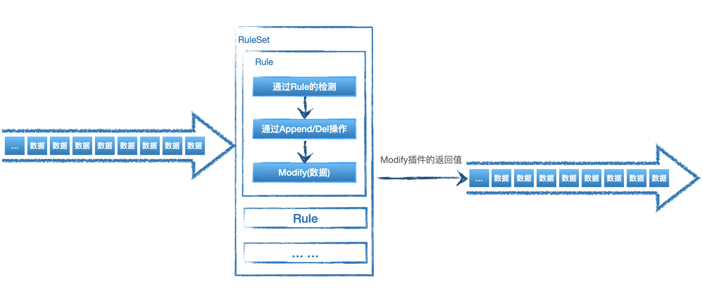

#### 6.2.10 Action

当我们需要做一些特殊操作，如联动其他系统，发送告警到钉钉/Lark/邮件，联动WAF封禁IP等操作的时候，我们可以通过Action来实现相关的操作，需注意仅支持插件，使用方式如下：

```
<action>emailtosec</action>
```

插件emailtosec的入参会是当前的数据，其他的操作可以按需求编写。

action也是支持多个插件，使用方式如下，需要按";"隔开：

```
<action>emailtosec1;emailtosec2</action>
```
在上面的例子中emailtosec1与emailtosec2都会被触发运行。

### 6.3 检测/执行顺序

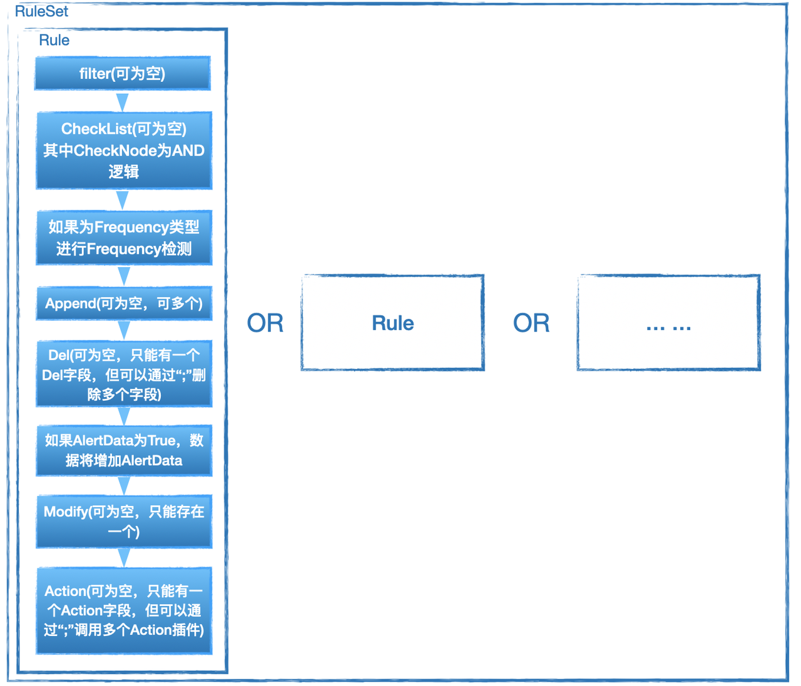

需要注意的是数据在通过Rule的过程中是动态的，即如果通过了append那么接下来如果是del那么del接收到的数据是append生效后的数据。

#### 6.3.1 Rule之间的关系

同一RuleSet中的Rule为"OR"的关系，假设RuleSet如下：

```
<root ruleset_id="test2" ruleset_name="test2" type="rule" undetected_discard="true">
<rule rule_id="detection_test_1" author="EBwill" type="Detection">
   <rule_name>detection_test_1</rule_name>
   <alert_data>True</alert_data>
   <harm_level>high</harm_level>
   <desc affected_target="test">这是一个Detection的测试1</desc>
   <filter part="data_type">59</filter>
   <check_list>
       <check_node type="INCL" part="exe">redis</check_node>
   </check_list>
</rule>
<rule rule_id="detection_test_2" author="EBwill" type="Detection">
   <rule_name>detection_test_2</rule_name>
   <alert_data>True</alert_data>
   <harm_level>high</harm_level>
   <desc affected_target="test">这是一个Detection的测试2</desc>
   <filter part="data_type">59</filter>
   <check_list>
       <check_node type="INCL" part="exe">mysql</check_node>
   </check_list>
</rule>
</root>
```

假设数据的exe字段为 mysql-redis，那么会detection_test_1于detection_test_2都会被触发且会产生两条数据向后传递，分别隶属这两条规则

### 6.4 更多的例子

```
<rule rule_id="critical_reverse_shell_rlang_black" author="lez" type="Detection">
    <rule_name>critical_reverse_shell_rlang_black</rule_name>
    <alert_data>True</alert_data>
    <harm_level>high</harm_level>
    <desc kill_chain_id="critical" affected_target="host_process">可能存在创建 R 反弹shell的行为</desc>
    <filter part="data_type">42</filter>
    <check_list>
        <check_node type="INCL" part="exe">
            <![CDATA[exec/R]]>
        </check_node>
        <check_node type="REGEX" part="argv">
            <![CDATA[(?:\bsystem\b|\bshell\b|readLines.*pipe.*readLines|readLines.*writeLines)]]>
        </check_node>
    </check_list>
    <node_designate>
    </node_designate>
    <del />    
    <action />
    <alert_email />
    <append append_field_name="" rely_part="" type="none" />
</rule>
```

```
<rule rule_id="init_attack_network_tools_freq_black" author="lez" type="Frequency">
    <rule_name>init_attack_network_tools_freq_black</rule_name>
    <freq_black_data>True</freq_black_data>
    <harm_level>medium</harm_level>
    <desc kill_chain_id="init_attack" affected_target="service">存在多次使用网络攻击工具的行为，可能存在中间人/网络欺骗</desc>
    <filter part="SMITH_ALETR_DATA.RULE_INFO.RuleID">init_attack_network</filter>
    <check_list>
    </check_list>
    <node_designate>
        <node part="agent_id" />
        <node part="pgid" />
    </node_designate>
    <threshold range="30" local_cache="true" count_type="classify" count_field="argv">3</threshold>
    <del />
    <action />
    <alert_email />
    <append append_field_name="" rely_part="" type="none" />
</rule>
```

```
<rule rule_id="tip_add_info_01" type="Detection" author="yaopengbo">
    <rule_name>tip_add_info_01</rule_name>
    <harm_level>info</harm_level>
    <threshold/>
    <node_designate/>
    <filter part="data_type">601</filter>
    <check_list>
        <check_node part="query" type="CUSTOM">NotLocalDomain</check_node>
    </check_list>
    <alert_data>False</alert_data>
    <append type="FIELD" rely_part="query" append_field_name="tip_data"></append>
    <append type="static" append_field_name="tip_type">3</append>
    <append type="CUSTOM_ALLORI" append_field_name="tip_info">AddTipInfo</append>
    <del/>
    <alert_email/>
    <action/>
    <desc affected_target="tip">dns新增域名tip检测信息</desc>
</rule>
```

### 6.5 规则编写建议

- filter的良好运用可以大大降低性能压力，filter的编写目标应该是让尽可能少的数据进入CheckList
- 尽可能少的使用正则

## 7 Elkeid HUB Plugin/插件

Elkeid HUB Plugin用于解除部分Ruleset在编写过程的限制，提高HUB使用的灵活性。通过编写plugin，可以实现部分编写Ruleset无法完成的操作。同时，如果需要和当前尚不支持的第三方组件进行交互，只能通过编写plugin来实现。

Elkeid HUB目前同时支持Golang Plugin和Python Plugin。当前存量Plugin采用Golang开发，通过Golang Plugin机制进行加载，由于局限性较大，当前不再对外开放，但在Ruleset编写中仍可使用存量Golang Plugin。目前仅对外开放Python Plugin。

Python Plugin本质是在HUB运行过程中，通过另外一个进程执行Python 脚本，并将执行结果返回给Elkeid HUB。

Plugin总计有6种类型，均在Ruleset编写文档中介绍过，以下会结合上文的例子对每种plugin展开介绍。 Plugin的类型命名与在Ruleset中的标签名并不一一对应，实际使用中请严格以文档为准。

### 7.1 通用参数介绍

#### 7.1.1 格式

每个Plugin都是一个Python Class，plugin加载时，HUB会实例化这个Class，并对该Class的name，type，log，redis四个变量进行赋值，每次plugin执行时，会调用该class的plugin_exec方法。

Class 如下：

```
class Plugin(object):

    def __init__(self):
        self.name = ''
        self.type = ''
        self.log = None
        self.redis = None
    
    def plugin_exec(self, arg, config):
        pass
```

#### 7.1.2 init

__init__方法中包含以下四个变量：

- name: Plugin Name
- type: Plugin Type
- log: logging
- redis: redis client

如果有自己的init逻辑，可以加在后面

#### 7.1.3 plugin_exec

plugin_exec方面有两个参数，arg和config。

- arg就是该plugin执行时接受的参数。根据plugin类型的不同，arg是string或dict()。

针对Action，Modify，Origin，OriginAppend四种类型的plugin，arg是dict()。

针对Append，Custom两种类型的plugin，arg是string。

- config是plugin可以接受的额外参数，目前只有Action和Modify支持，如果在Ruleset中有指定，会通过config参数传递给plugin。

例如：在ruleset中添加了extra标签，HUB会以dict的形式以config入参调用plugin_exec方法。extra中使用:作为kv的分隔符 ;作为每组kv的分隔符

```
<action extra="mail:xxx@bytedance.com;foo:bar">PushMsgToMatao</action>
```


```
config = {"mail":"xxx@bytedance.com"}
```
### 7.2 example

#### 7.2.1 Plugin之Action

在rule中的作用见6.2.10。

Action用于实现数据通过当前rule之后执行一些额外操作。

一个Action plugin接收的是整个数据流的拷贝。返回的是action是否执行成功。action是否执行成功不会影响数据流是否继续向下走，只会在HUB的日志中体现。

实现参考

```
class Plugin(object):


    def __init__(self):
        self.name = None
        self.type = None
        self.log = None
        self.redis = None


    def plugin_exec(self, arg, config):
        # 例：请求某个回调地址
        requests.post(xxx)
        result = dict()
        result["done"] = True
        return result
```

#### 7.2.2 Plugin之Append

在rule中的作用见6.2.7.3

Append和OriginAppend类似，均是可以自定义Append操作，不同的是Append接受的数据流中确定的某个属性值，而OriginAppend接受的是整个数据流的拷贝。两者的返回值均会写入到数据流中指定属性中。

实现参考

```
class Plugin(object):
    def __init__(self):
        self.name = None
        self.type = None
        self.log = None
        self.redis = None
    def plugin_exec(self, arg, config):
        result = dict()
        result["flag"] = True
        # 在原arg后面加上__new__后缀
        result["msg"] = arg + "__new__"
        return result
```

#### 7.2.3 Plugin之Custom

在rule中的作用见6.2.5.2中的Custom

CUSTOM用于实现自定义CheckNode。CheckNode中虽然预定义了10余种常见的判断方式，但在实际rule编写过程中，必然无法完全覆盖，所以开放了plugin拥有书写更灵活的判断逻辑。

该plugin接收的参数是数据流中指定的属性值，返回的是是否命中以及写入hit中部分。

实现参考

```
class Plugin(object):
    def __init__(self):
        self.name = None
        self.type = None
        self.log = None
        self.redis = None
    def plugin_exec(self, arg, config):
        result = dict()
        # 若arg长度为10
        if arg.length() == 10:
            result["flag"] = True
            result["msg"] = arg
        else:
            result["flag"] = True
            result["msg"] = arg
        return result
```

#### 7.2.4 Plugin之Modify

在rule中的作用见6.2.9

Modify是所有plugin中灵活度最高的plugin，当编写ruleset或其他plugin无法满足需求时，可以使用modify plugin，获得对数据流的完全操作能力。

Modify插件的入参是当前数据流中的一条数据。返回分两种情况，可以返回单条数据，也可以返回多条数据。

返回单条数据时，Flag为true，数据在Msg中，返回多条数据时，MultipleDataFlag为true，数据在数组MultipleData中。若Flag和MultipleDataFlag同时为true，则无意义。

实现参考1:

```
class Plugin(object):
    def __init__(self):
        self.name = None
        self.type = None
        self.log = None
        self.redis = None
    def plugin_exec(self, arg, config):
        result = dict()
        # 随意修改数据，例如加个字段
        arg["x.y"] = ["y.z"]
        result["flag"] = True
        result["msg"] = arg
        return result

```

实现参考2:

```
class Plugin(object):
    def __init__(self):
        self.name = None
        self.type = None
        self.log = None
        self.redis = None
    def plugin_exec(self, arg, config):
        result = dict()
        # 将该条数据复制成5分
        args = []
        args.append(arg)
        args.append(arg)
        args.append(arg)
        args.append(arg)
        args.append(arg)
        result["multiple_data_flag"] = True
        result["multiple_data"] = args
        return result

```

#### 7.2.5 Plugin之Origin

在rule中的作用见6.2.5.2中的CUSTOM_ALLORI

Custom插件的进阶版，不再是对数据流中的某个字段进行check，而是对数据流中的整条数据进行check。入参由单个字段变成了整个数据流。

实现参考

```
class Plugin(object):
    def __init__(self):
        self.name = None
        self.type = None
        self.log = None
        self.redis = None
    def plugin_exec(self, arg, config):
        result = dict()
        # 若arg["a"]和arg["b"]长度长度都为10
        if arg["a"].length() == 10 and arg["b"].length() == 10:
            result["flag"] = True
            result["msg"] = ""
        else:
            result["flag"] = False
            result["msg"] = ""
        return result
```

#### 7.2.6 Plugin之OriginAppend

在rule中的作用见6.2.7.4

Append插件的进阶版，不再是对数据流中的某个字段进行判断然后append，而是对数据流中的整条数据进行判断。入参由单个字段变成了整个数据流。

实现参考

```
class Plugin(object):
    def __init__(self):
        self.name = None
        self.type = None
        self.log = None
        self.redis = None
    def plugin_exec(self, arg, config):
        result = dict()
        result["flag"] = True
        # 合并两个字段
        result["msg"] = arg["a"] + "__" + arg["b"]
        return result
```

### 7.3 Plugin 开发流程

plugin的运行环境为pypy3.7-v7.3.5-linux64，如果希望python脚本正常运行，需要在此环境下进行测试。

HUB自身引入了部分基础依赖，但远无法覆盖python常用package，当有需要时，需要用户通过如下方式自行安装。

1. venv位于`/opt/Elkeid_HUB/plugin/output/pypy`下，可以通过以下命令切换到venv中，执行pip install进行安装。

```
source /opt/Elkeid_HUB/plugin/output/pypy/bin/activate
```

2. 在plugin的init方法中调用pip module，进行安装

#### 7.3.1 创建Plugin

1. 点击创建plugin按钮


2. 按照需求，填写信息


3. 点击Confirm，完成创建


4. 查看Plugin


5. 下载plugin

Plugin创建成功时会自动下载Plugin，之后也可以点击界面上的下载按钮再次下载

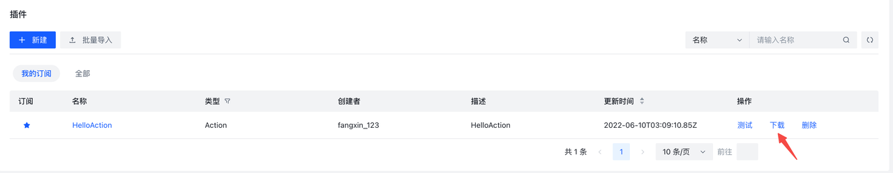

#### 7.3.2 在线开发&测试Plugin

单击Name或者点击View Plugin按钮，会弹出Plugin.py预览界面，可以在此界面预览&编辑代码。

编辑器默认处于只读模式，单击Edit按钮，编辑器会转换为读写模式，此时可以编辑Plugin。

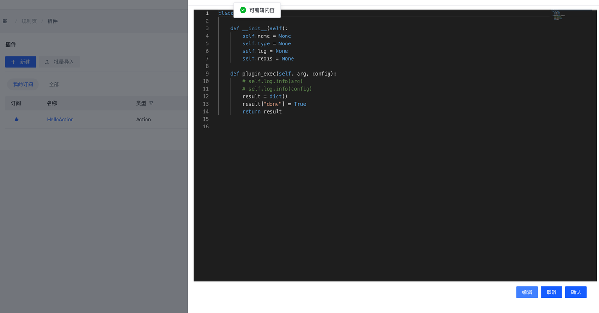

编辑完成后，可以点击Confirm按钮进行保存，或者点击Cancel按钮放弃更改。

点击Confirm按钮后，改动不会实时生效，和Ruleset类似，同样需要Publish操作。

#### 7.3.3 本地开发Plugin

解压创建plugin时的自动下载的zip包，可以使用IDE打开，执行test.py即可测试plugin。

测试无误后，需要手动压缩会zip文件进行上传。

压缩时需要注意，确保所有文件都在zip的根目录下。


#### 7.3.4 上传Plugin

1. 点击界面的上传按钮

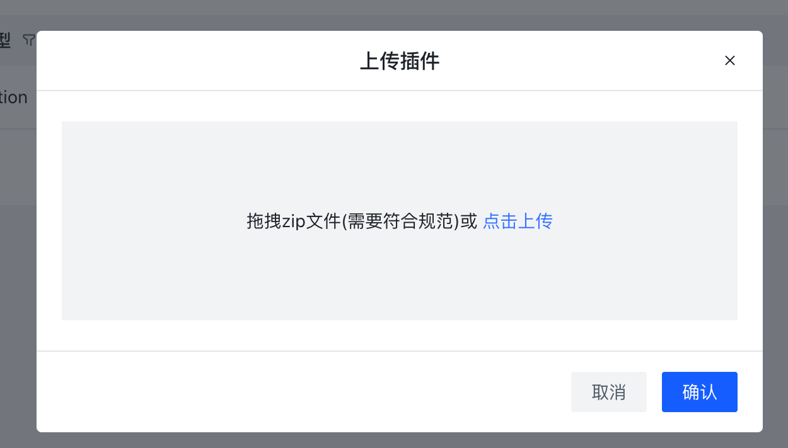

1. 同策略发布相同，在策略发布界面发布策略

### 7.4 Plugin 常见开发依赖

#### 7.4.1 requests

Elkeid HUB 默认引入了requests库，可以使用requests库实现http请求。

参考代码如下：
```
import requests
import json
def __init__(self):
    ...
    
def plugin_exec(self, arg, config):
    p_data = {'username':user_name,'password':user_password}    
    p_headers = {'Content-Type': 'application/json'}
    r = requests.post("http://x.x.x.x/", data=json.dumps(p_data), headers=p_headers)
    result["flag"] = True
    result["msg"] = r.json()['data']
    return result

```

#### 7.4.2Redis

Plugin Object在执行完__init__方法后，执行plugin_exec方法前，HUB会将redis连接设置到self.redis中，之后可以在plugin_exec方法中调用redis。该redis为HUB自身配置的redis，使用的库为 https://github.com/redis/redis-py。

参考代码如下：
```
redis_result = self.redis.get(redis_key_prefix + arg)

self.redis.set(redis_key_prefix + arg, json.dumps(xxx), ex=random_ttl())
```

#### 7.4.3Cache

Elkeid HUB 默认引入了cacheout库，可以使用cacheout库实现本地cache，或配合redis实现多级cache。cacheout文档参考https://pypi.org/project/cacheout/ 。

简单示例：

```
from cacheout import LRUCache
class Plugin(object):
    def __init__(self):
        ...
        self.cache = LRUCache(maxsize=1024 * 1024)
        ...
        
    def plugin_exec(self, arg, config):
        ...
        cache_result = self.cache.get(arg)
        if cache_result is None:
           pass
        ...
        self.cache.set(arg, query_result, ttl=3600)
        ...
```

配合redis实现多级cache：
```
from cacheout import LRUCache
class Plugin(object):
    def __init__(self):
        ...
        self.cache = LRUCache(maxsize=1024 * 1024)
        ...
        
    def plugin_exec(self, arg, config):
        ...
        cache_result = self.cache.get(arg)
        if cache_result is None:
            redis_result = self.redis.get(redis_key_prefix + arg)
            if redis_result is None:
                # fetch by api
                ...
                self.redis.set(prefix + arg, json.dumps(api_ret), ex=random_ttl())
                self.cache.set(arg, ioc_query_source, ttl=3600)
            else:
                # return
                ...
        else:
            # return
            ...
```

## 8 Project/项目

### 8.1 Project

Project 是被执行策略的最小单元，主要描述数据流内的数据过程。从Input开始到Output或RuleSet结束，我们先来看一个例：

```
INPUT.hids --> RULESET.critacal_rule
RULESET.critacal_rule --> RULESET.whitelist
RULESET.whitelist --> RULESET.block_some
RULESET.whitelist --> OUTPUT.hids_alert_es
```


我们来描述一下这个Project的配置：

`INPUT.hids` 从远端消费数据 传递到 `RULESET.critacal_rule`

`RULESET.critacal_rule` 检出的数据 传递到 `RULESET.whitelist`

`RULESET.whitelist` 检出的数据 传递到 `RULESET.block_some` 和 `OUTPUT.hids_alert_es`

其中`RULESET.block_some`可能是通过`action`联动其他组件进行一些封禁操作，`OUTPUT.hids_alert_es`显而易见是将数据打到外界的es中

### 8.2 关于ElkeidDSL语法

在HUB中有一下几个概念:

|名称/操作符|介绍|SmithDSL表示方法|例|
| :- | :- | :- | :- |
|INPUT|数据输入源|INPUT.输入源ID|INPUT.test1|
|OUTPUT|数据库输出源|OUTPUT.输出源ID|OUTPUT.test2|
|RULESET|规则集|RULESET.规则集ID|RULESET.test3|
|—>|数据传递|—>|INPUT.A1 —> RULESET.A|

### 8.3 关于数据传递

数据传递尽可以使用:`-->`来表示.

如我们想将数据输入源HTTP_LOG传递到规则集HTTP:
```
INPUT.HTTP_LOG --> RULESET.HTTP
```

如果我们想让以上的告警通过数据输出源SOC_KAFKA输出的话:
```
INPUT.HTTP_LOG --> RULESET.HTTP  
RULESET.HTTP --> OUTPUT.SOC_KAFKA
```

如果我们想让以上的告警通过数据输出源SOC_KAFKA和SOC_ES输出的话:
```
INPUT.HTTP_LOG --> RULESET.HTTP  
RULESET.HTTP --> OUTPUT.SOC_KAFKA
RULESET.HTTP --> OUTPUT.SOC_ES
```

## 9 Elkeid HUB 前端使用指南

前端主要包括首页，RuleEdit（规则页），Publish（规则发布），Status（日志/状态），User Management（系统管理），Debug（规则测试）五个部分。这部分只介绍前端页面的使用，具体的规则配置和字段含义，请参考前面章节。

### 9.1 使用流程

1. 规则发布：

  - 到**规则页**-->**输入源/输出/规则集/插件/项目** 进行相关的编辑和修改。

  - 再到**规则发布**-->**规则发布**页面将规则发布到hub集群。

2. **项目操作**：

  - 到**规则发布**-->**项目操作**页面start/stop/restart对应的project。

### 9.2 首页


首页主要包括**HUB状态信息**， **QPS信息**，**HUB占用信息**，**工具栏**。工具栏包括中英文切换，页面模式切换与通知栏信息。

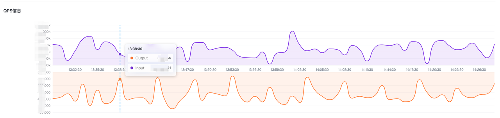

QPS信息展示了整体的Input和Output的qps信息，数据30秒更新一次。这里只是作为大盘展示，如需查看更加详细的信息，可到规则页-->项目-->项目详情页面查看。

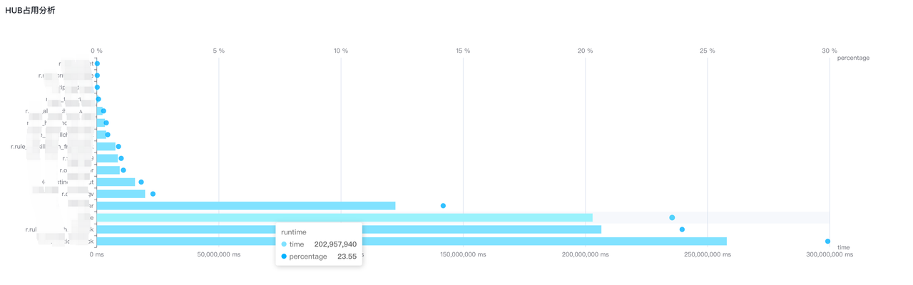

HUB占用信息通过分析ruleset使用的cpu时间来对HUB占用情况进行分析，会给出HUB占用信息的条形图，包含规则集使用的CPU时间以及比例，通过该条形图可以分析哪些规则集占用了大量资源，从而进行针对性地优化。

### 9.3 Rule Edit/规则页

所有的规则（包括Input/Output/Ruleset/Plugin/Project）增删查改都在RuleEdit里面进行。

> 这里编辑后的规则并不会自动发布到HUB集群，如需发布，请到Publish-->RulePublish页面进行操作。

**为了便于快速找到自己相关的配置，配置列表会分为两个Tab，My Subscription展示用户收藏的配置信息、另一个则展示全部的配置（如input）。用户可以先去全部配置找到需要管理的配置并收藏该配置方便下次修改。**

#### 9.3.1 Input/输入源


输入源页面支持新增、文件导入：

1. 新增：点击新增，会出现如下页面，具体的字段含义可参考上文**Elkeid Input**章节。

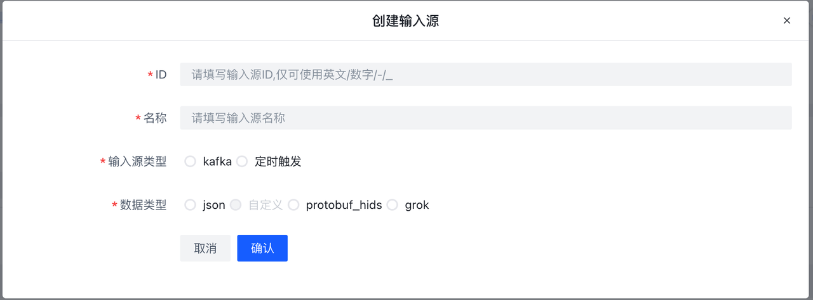

2. 文件导入：首先根据需求创建一个input文件，目前支持yml格式的。举例如下。

```
InputID: test_for_example
InputName: test_for_example
InputType: kafka
DataType: json
TTL: 30
KafkaBootstrapServers: test1.com:9092,test2.com:9092
KafkaGroupId: hub-01
KafkaOffsetReset: latest
KafkaCompression: none
KafkaWorkerSize: 3
KafkaOtherConf: ~

KafkaTopics:
  - testtopic
```
然后点击导入，选择要导入的文件，弹出框后再 确认导入，即可。

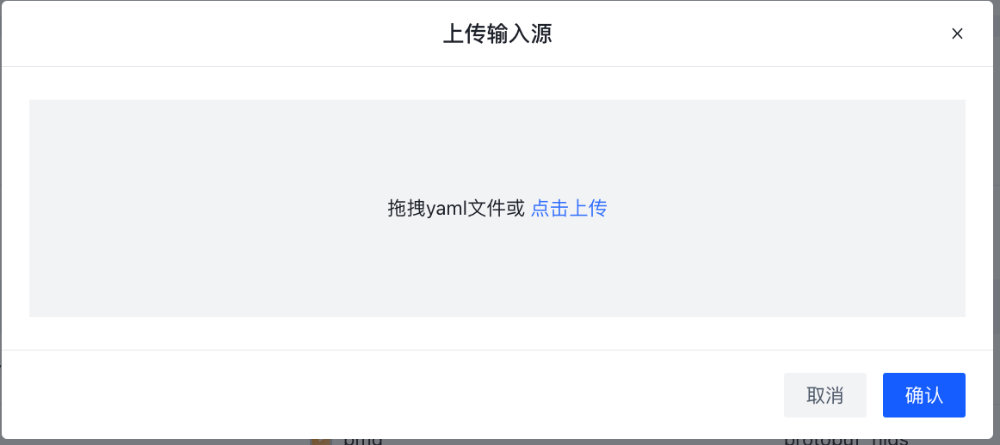

3. 采样

点击采样，可以获取到输入源运行过程中的采样数据。

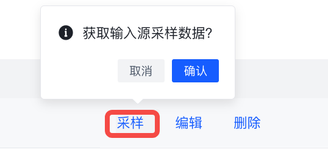

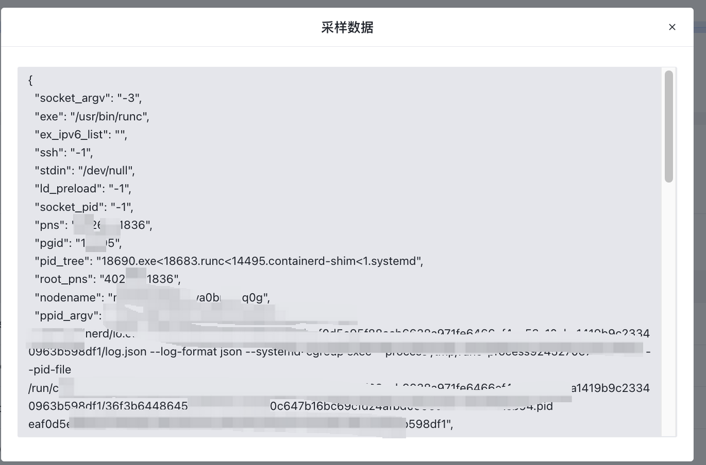

#### 9.3.2 Output/输出

输出的使用与输入源类似，支持elasticsearch、kafka、influxdb三种类型。

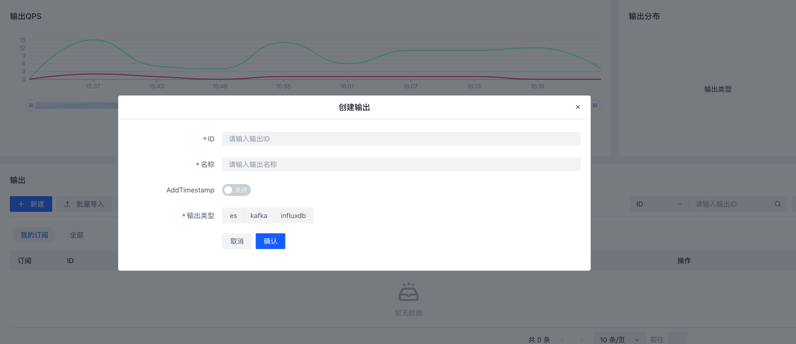

#### 9.3.3 RuleSet/规则集

1. 规则集页面

同样的，规则集也支持页面新增和文件导入，同时也支持全量导出全部规则。

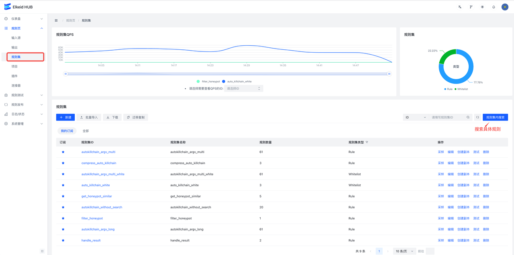

**采样** 按钮可以查看这个规则的输入/输出样例数据（如果这个规则一直没数据进入，则会无数据）。

测试会对**非加密**的规则集进行测试，以测试数据为输入，记录数据流入规则集后的命中概况。如果选择**染色规则**，那么会记录命中的具体数据。（**对数据库存在负载，建议考量测试数据的数目大小使用**），如果规则集正在运行，可以使用**载入数据**载入采样数据，进行测试。详见规则测试/Debug页面

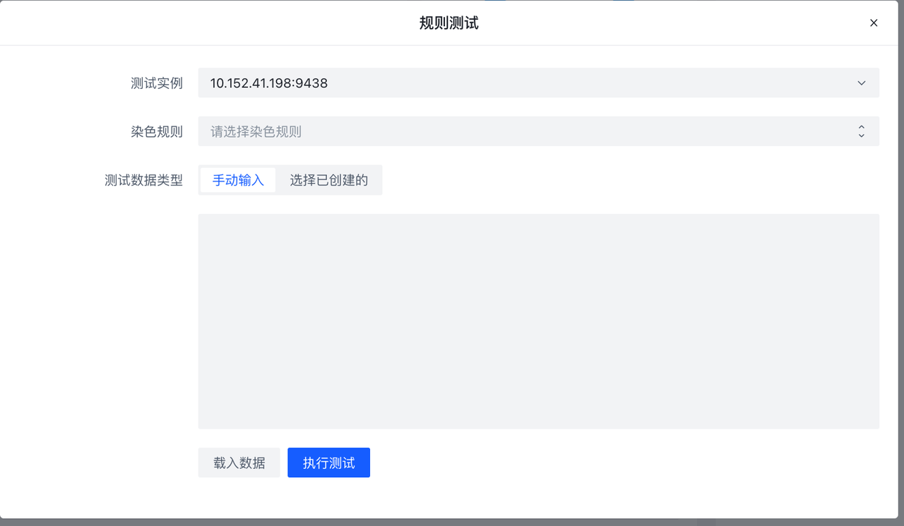

**创建副本** 按钮会以当前规则集为模版，创建一个副本集规则，会在rulesetid和rulesename加上_copy后缀：


**规则集内搜索**提供了对所有规则集的全局搜索。会匹配所有规则集中对应的规则ID。对搜索的结果用户可以跳转到编辑或删除该rule。

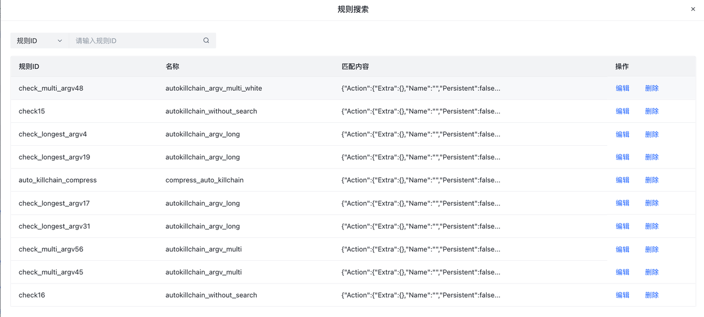

2. 规则页面

点击各个规则集的**规则集ID**按钮可以查看其详情，进入到rule的编辑页面。


**新建**按钮是对当前规则集来增加一条规则。这里支持**XML编辑**和**表格编辑**两种方式，可通过点击**表单编辑**和**XML编辑**进行切换。

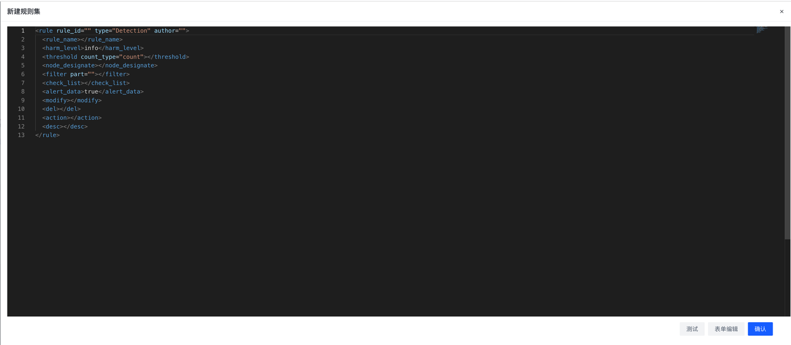

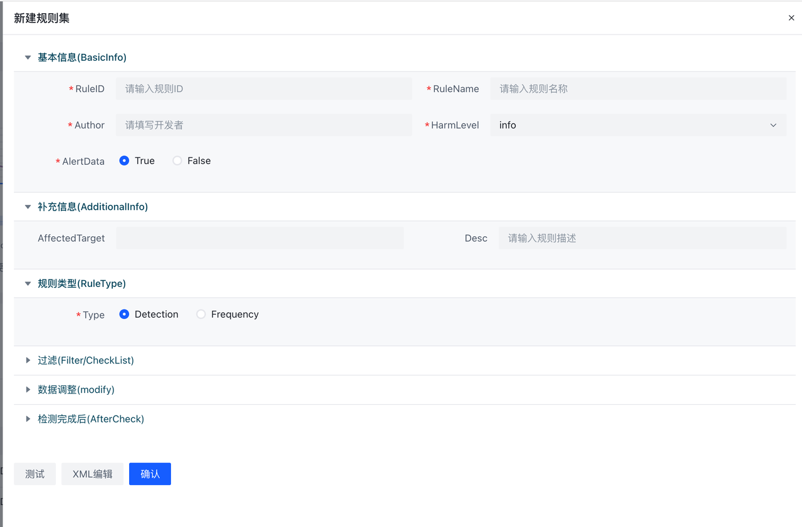

**测试**按钮支持对单一规则进行测试，采样按钮可从Hub导入样例数据（如果有的话），点击执行，则会将样例数据发送到Hub实例进行测试。测试不会影响到线上的数据流。

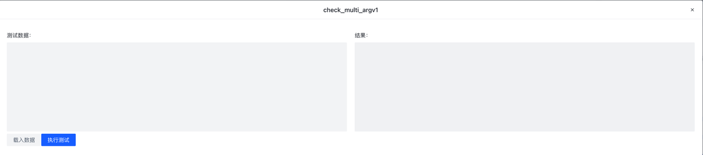

#### 9.3.4 Plugin/插件

详情见7.3 Plugin开发流程

#### 9.3.5 Project/项目

**项目**也支持页面新增和文件导入。Running/Stopped/Unknown分别代表正在运行/未在运行/未知该项目的机器数。特别的，状态数据每30s更新一次。


点击**项目ID**进入项目详情页面。可以查看项目详情信息，Input lag（仅限kafka），各个组件的qps信息。同时在节点图处右键点击节点可以查看节点SampleData或跳转到节点详情。

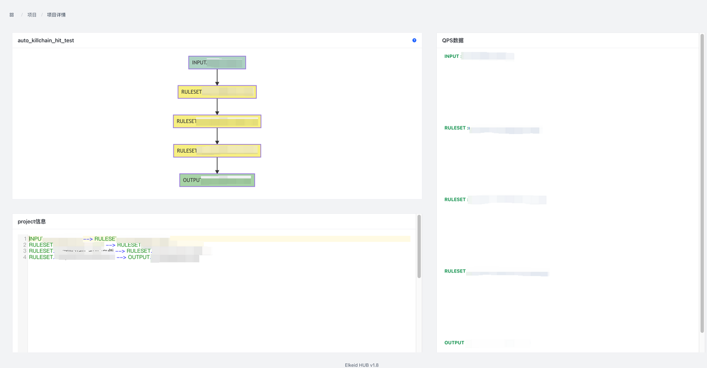

测试按钮会对不包含加密规则集的项目进行测试，测试流程同规则集测试。

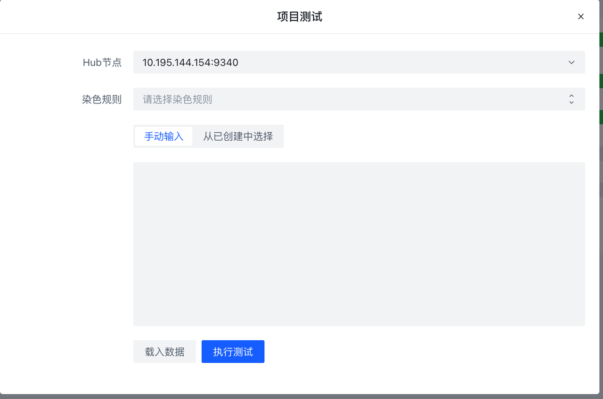

### 9.4 Publish/规则发布

所有涉及到对hub集群的变更的操作都在这个页面下。

#### 9.4.1 RulePublish/规则发布

这里进行规则发布，编辑后的规则变更操作，在这个页面能看到。

**提交更改**，则将变更发布到HUB集群；**撤销更改**，则丢弃所有变更，将规则回滚到上一个稳定版本（上次提交变更的版本）。


点击**diff**会查看该变动的详细信息

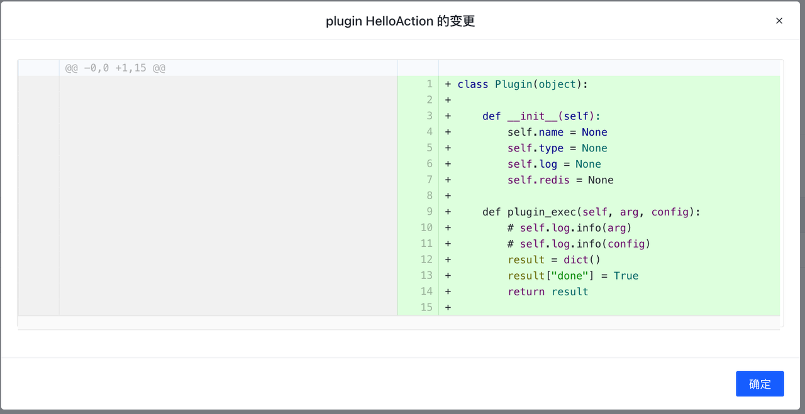

提交更改后，会自动跳转到Task Detail页面。可以查看成功失败机器数，失败的错误信息，以及本次task的变更详情及diff。


#### 9.4.2 Project Operation/项目操作

这个页面用来控制项目的启动，停止和重启。所有新增的项目默认都是停止状态，需要到此页面进行手动开启。

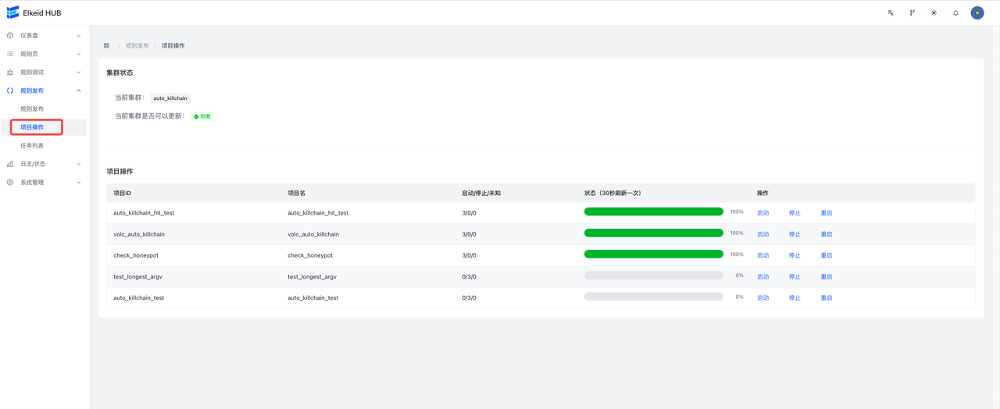

#### 9.4.3 Task/任务列表

任务列表页面展示了所有向hub集群下发过的任务。


### 9.5 Status/状态页

状态用于展示HUB的运行状态，错误事件以及leader操作记录。

#### 9.5.1 Event/HUB事件

Event为HUB产生的错误信息，leader收集错误信息并进行汇总聚合，因此每条信息可能是多个hub机器在一段时间内共同发生的错误，在列表中可以看到event等级，主机数，位置以及信息。在上方可以根据时间和Event类型进行筛选。点击左侧小箭头可以展开查看错误详情。

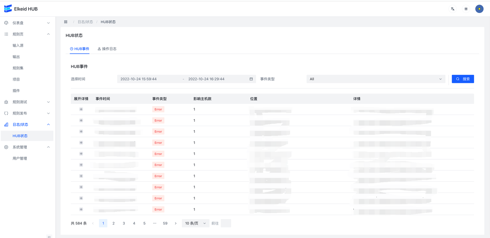

每条错误信息包含了错误的详细信息，trace，以及hub机器的ip:port。

#### 9.5.3 Log/操作日志

Log用来记录对HUB的修改操作。Log中包含URL，操作用户，IP，时间等信息，在上方可以通过时间来进行筛选。


### 9.6 System Management/系统管理

这个页面用来管理HUB用户，用户可以新建用户，删除用户，以及对用户的权限进行管理

#### 9.6.1 用户管理

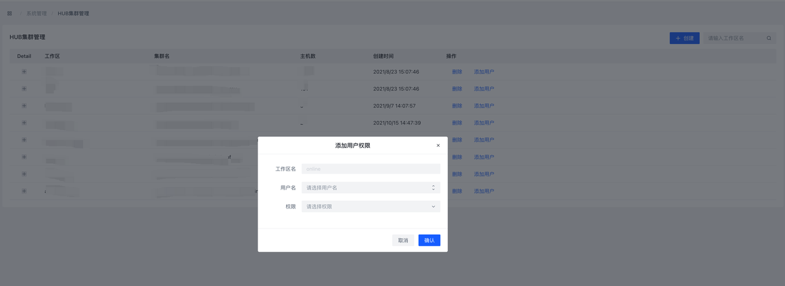

点击添加用户可以新建用户，在界面中设置用户的用户名，密码，以及用户等级，用户等级共分为6级，分别是admin、manager、hub readwirte、hub readonly。

- **admin**用户可以访问全部的页面和接口
- **manager** 用户可以访问除用户管理外的页面和接口
- **hub readwrite** 用户可以使用hub相关的普通页面和接口，并拥有读写权限
- **hub readonly** 用户可以使用hub相关的普通页面和接口，并拥有只读权限

### 9.8 Debug/规则测试

用于对已经编写好的**规则**/**规则集**/**项目**进行测试，测试其功能是否符合预期。

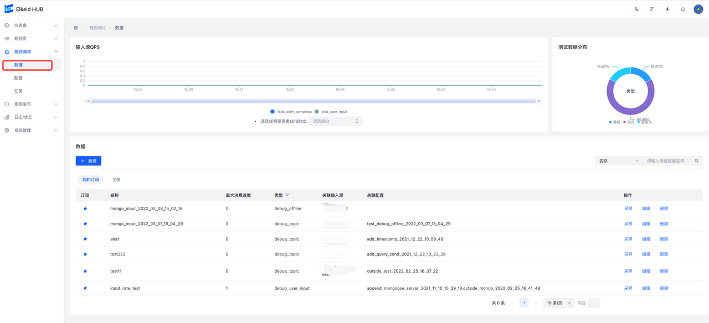

DataSource（数据）、Debug Config（配置）、Debug Task（任务）关联如下：

每个**配置**包含一份**数据**，与一个测试组件（规则、规则集或项目）。**配置**创建**任务**时会给它分配一个Host，**任务**被执行时，也仅会在该Host上被执行。


#### 9.8.1 Data Source/数据

数据源，可以理解成类型可配置的、限制消费数据数目的**输入源**。


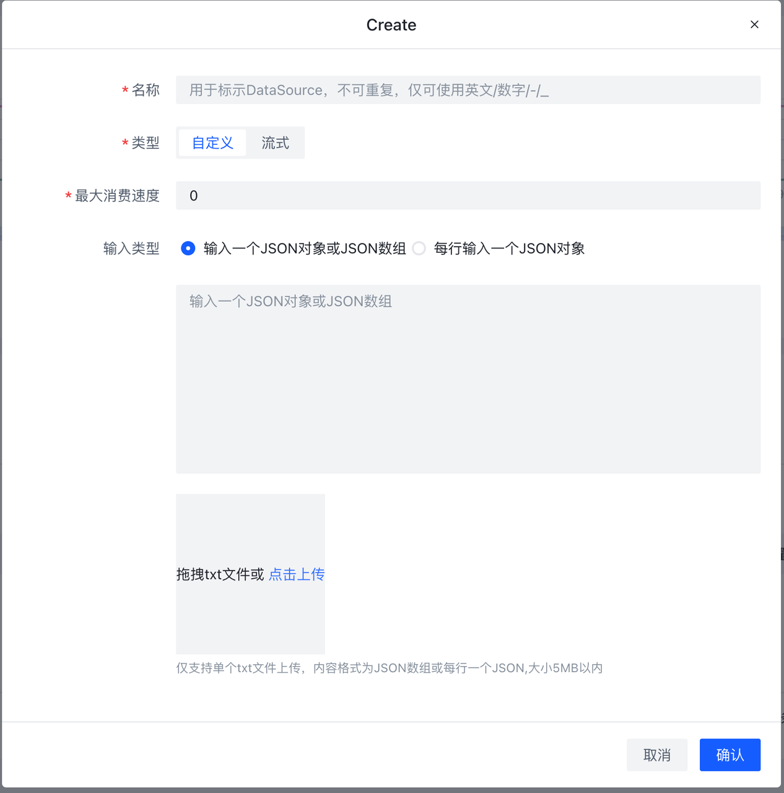

- 类型:数据源类型，共两种：
  1. debug_user_input（自定义）:用户输入数据源；
  2. debug_topic(流式):实际输入源，该类型的数据限制消费50条输入源。
- 关联配置:关联配置列表，展示使用了该数据源的`Debug Config`
- 关联输入源:表示该数据源代表的输入源，仅类型为`debug_topic`时不为空。

#### 9.8.2 Debug Config/配置


字段说明：

- `类型`:配置类型，表示是根据哪种测试组件创建的配置
- `染色规则` : 表示“染色”的rule节点，选择需要“染色”的rule后，经过这条rule的数据会带上染色字段标记。可以不选择，此时该**配置**生成的**任务**将不会收集具体的数据。
- `状态` :配置状态：
  - `全部配置` 准备完成，此时可以创建任务
  - `未确认` 可能未配置**数据**或者**数据**被删除，需要创建**数据**才可以创建**数据**
  - `测试概况` 未配置染色规则，此时可以创建任务，但不会收集具体的数据，只能看到每个节点（input/ruleset/output）的概况数据，如In/Out(流入rule的数据数目，流出该规则的数据数目).

#### 9.8.3 Debug Task/任务


字段说明：

- 任务状态:状态
  - 未定义:未定义，可能是hub升级或退出导致任务被删除，此时无法查看结果
  - 已准备:已准备就绪，此时点击启动任务可以执行任务
  - 运行中:运行中
  - 已完成:运行成功，此时点击**查看结果**可以查看结果

结果页：


- 左上：DSL图。方便查看测试的project 结构，左上角为任务ID
- 左下：概览结果。展示了各个节点数据的流入/流出情况。
  - In：数据流入条数
  - Out：数据流出条数
  - LabelIn：染色数据流入条数
  - LabelOut：染色数据流出跳出
- 右：详情结果。可以查看本次任务的染色数据，支持分页查询