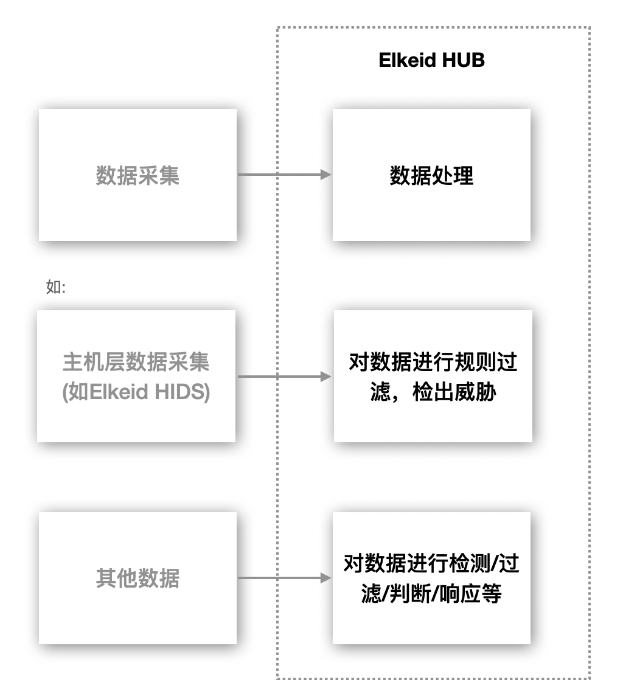
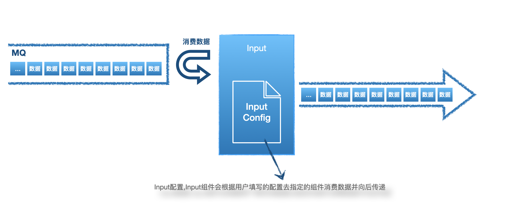
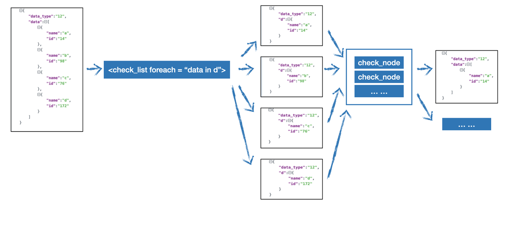
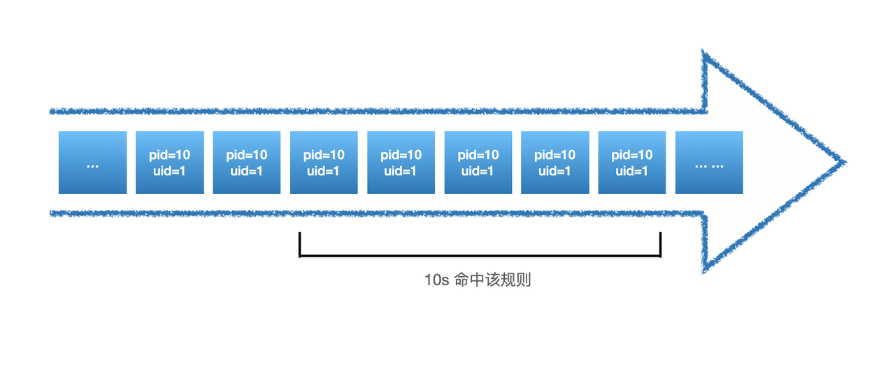
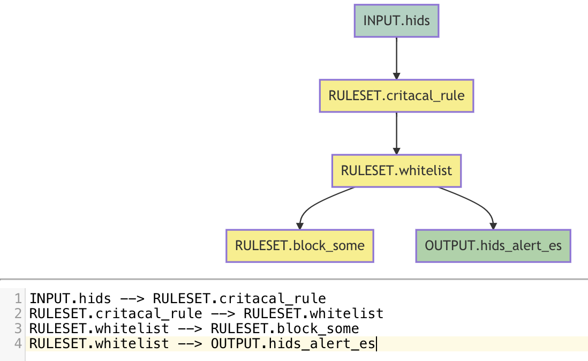

# Elkeid HUB 社区版使用手册

## 1 概述

Elkeid HUB 是为了解决各领域内的 **数据上报-实时流处理与事件处理** 中的 **实时处理** 的需求而诞生的产品，除适用于信息安全领域中的**入侵检测/事件处理与编排**等场景外，在**异常检测，日志处理，反欺诈**等流式数据处理的通用场景也可以应用。



## 2 Elkeid HUB 优势

- **高性能**，可以对处理千万级TPS的数据进行实时处理（集群部署）
- **策略编写简单易懂**，相关同学只需专注数据处理本身且学习成本很低
- **支持插件**，可以更好的处理复杂需求
- **部署简单**，依赖少


## 3 Elkeid HUB 社区版 License

使用非商业友好协议：[License](https://github.com/bytedance/Elkeid-HUB/blob/main/LICENSE)


## 4 Elkeid Input



### 4.1 Input配置建议

- 输入源目前仅支持Kafka作为数据输入源，数据格式支持**Json**，**任意字符分割**的日志两种。
- 数据源类型建议:
  - **其他安全产品的告警日志**，HUB可以有效的对其进行二次处理，如联动其他基础组件做到对告警数据的缺失部分弥补，也可以通过自定义Action(规则引擎支持)来实现对告警进行自动化处理已完成告警-处置的闭环操作
  - **基础日志**，如HTTP镜像流量/Access日志/HIDS数据等。通过规则引擎，联动模块和异常检测模块对原始数据进行安全分析/入侵检测/自动化防御等操作
  - **审计日志**，如:登陆，原始的SQL请求，敏感操作等日志。HUB可以对其进行自定义的审计功能

### 4.2 Input配置说明

| 字段                  | 说明                                                        |
| --------------------- | ----------------------------------------------------------- |
| InputID               | 不可重复，描述一个input，只能由小写英文或"_-"或数字组成     |
| InputName             | 描述该input的name，可以重复，可以使用中文                   |
| InputType             | 目前只支持Kafka                                             |
| DataType              | json或者custom                                              |
| DataPattern           | DataType为custom时有意义，描述数据格式                      |
| Separator             | DataType为custom时有意义，分割数据所用符号                  |
| KafkaBootstrapServers | KafkaBootstrapServers，IP:PORT,使用,分割                    |
| KafkaGroupId          | 消费时使用的GroupID                                         |
| KafkaOffsetReset      | earliest或latest                                            |
| KafkaCompression      | kafka内数据压缩算法                                         |
| KafkaWorkerSize       | 并发消费数，建议按具体情况调整                              |
| KafkaOtherConf        | 支持其他配置，具体配置见：https://github.com/edenhill/librdkafka/blob/master/CONFIGURATION.md |
| KafkaTopics           | 消费Topic，支持多Topic                                      |

配置举例(DataType: json):

```yaml
InputID: wafdeny
InputName: wafdeny
InputType: kafka
DataType: json
KafkaBootstrapServers: secmq1.xxx.com:9092,secmq2.xxx.com:9092,secmq3.xxx.com:9092,secmq4.xxx.com:9092
KafkaGroupId: smith-hub
KafkaOffsetReset: latest
KafkaCompression: none
KafkaWorkerSize: 3
KafkaOtherConf: ~
KafkaTopics:
  - wafdeny
```

配置举例(DataType: custom):

```YAML
InputID: officefirewall
InputName: officefirewall
InputType: kafka
DataType: custom
KafkaBootstrapServers: 10.6.25.186:9092,10.6.25.189:9092,10.6.25.210:9092
KafkaGroupId: smith-hub
KafkaOffsetReset: latest
KafkaCompression: none
KafkaWorkerSize: 2
KafkaOtherConf: ~
DataPattern: date|time|protocol|source_ip|source_port|destination_ip|destination_port|source_zone|destination_zone|rule_name
Separator: "|"
KafkaTopics:
  - officefirewall
```

## 5 Elkeid Output


### 5.1 Output配置建议

由于HUB是一款流数据处理工具，不具备存储能力，建议配置数据存储的输出源，如ES、Hadoop、SOC、SIEM等平台。目前支持的Output类型有：

- Kafka
- ES（Elasticsearch）

### 5.2 Output配置说明

配置字段：

| 字段                  | 说明                                                         |
| --------------------- | ------------------------------------------------------------ |
| OutputID              | 不可重复，描述一个output，只能由小写英文或"_ -"或数字组成    |
| OutputName            | 描述该output的name，可以重复，可以使用中文                   |
| OutputType            | es或kafka                                                    |
| AddTimestamp          | true或false，开启后还在最终结果处新增timestamp字段并附上时间戳（如果已有该字段会覆盖）格式为：2021-07-05T11:48:14Z |
| KafkaBootstrapServers | OutputType为kafka时有意义                                    |
| KafkaTopics           | OutputType为kafka时有意义                                    |
| KafkaOtherConf        | OutputType为kafka时有意义                                    |
| ESHost                | OutputType为es时有意义，支持数组                             |
| ESIndex               | OutputType为kafka时有意义                                    |
| ESAuthUser            | OutputType为es时有意义，可选                                 |
| ESAuthPasswd          | OutputType为es时有意义，可选                                 |
| ESIndexRefreshType    | OutputType为es时有意义，可选，hour/day/month                 |
| ESGzip                | OutputType为es时有意义，可选                                 |
| ESSniff               | OutputType为es时有意义，可选                                 |

配置举例(es):

```YAML
OutputID: es_abnormal_dbcloud_task
OutputName: es_abnormal_dbcloud_task
OutputType: es
ESHost:
  - http://10.6.24.60:9200
ESIndex: abnormal_dbcloud_task
```

配置举例(kafka):

```YAML
OutputID: dc_sqlhunter
OutputName: dc_sqlhunter
OutputType: kafka
KafkaBootstrapServers: 10.6.29.112:9092,10.6.29.113:9092,10.6.29.126:9092
KafkaTopics: mysqlaudit_alert
KafkaOtherConf: ~
```

## 6 Elkeid HUB RuleSet

RuleSet是HUB实现核心检测/响应动作的部分，需要根据具体业务需求来实现，下图是RuleSet在HUB中的简单工作流程：


### 6.1 RuleSet

HUB RuleSet是通过XML来描述的规则集

RuleSet存在两种类型，**rule** 和 **whitelist**，如下：

```xml
<root ruleset_id="test1" ruleset_name="test1" type="whitelist">
... ....
</root>
<root ruleset_id="test2" ruleset_name="test2" type="rule" undetected_discard="true">
... ...
</root>
```

其中RuleSet的<root></root>是固定的模式，不可随意变更，其他属性：

| 字段               | 说明                                                         |
| ------------------ | ------------------------------------------------------------ |
| ruleset_id         | 不可重复，描述一个ruleset，只能由小写英文或"_/-"或数字组成   |
| ruleset_name       | 描述该ruleset的name，可以重复，可以使用中文                  |
| type               | 为rule或者whitelist，其中rule代表着的检测到继续向后传递，whitelist则为检测到不向后传递；向后传递的概念可以简单的理解为该ruleset的检出事件 |
| undetected_discard | 仅在type为rule时有意义，意为未检测到是否丢弃，若为true，则未被该ruleset检测到则丢弃，若为false，则为未被该rulset检测到也继续向后传递 |

### 6.2 Rule

接下来我们来了解rule的具体语法，通常ruleset是由一个或多个rule组成的，需要注意的是多个rule之间的关系是'或'的关系，即如果一条数据可以命中其中的一条或多条rule。

```HTML
<root ruleset_id="test2" ruleset_name="test2" type="rule" undetected_discard="true">
    <rule rule_id="rule_xxx_1" author="xxx" type="Detection">
        ... ...
    </rule>
    <rule rule_id="rule_xxx_2" author="xxx" type="Frequency">
        ... ...
    </rule>
</root>
```

一个rule的基本属性有：

| 字段    | 说明                                                         |
| ------- | ------------------------------------------------------------ |
| rule_id | 在同一个ruleset中不可重复，标识一个rule                      |
| author  | 标识rule的作者                                               |
| type    | rule有两种类型，一种是Detection，是无状态的检测类型规则；另一种是Frequency，是在Detection的基础上对数据流进行频率的相关检测 |

我们先来看两种不同类型规则的简单示例。

我们先假设从Input传入到Ruleset的数据样例为：

```JSON
{
    "data_type":"59",
    "exe":"/usr/bin/nmap",
    "uid":"0"
}
```

##### 6.2.1 Detection 简单例子

```HTML
<rule rule_id="detection_test_1" author="EBwill" type="Detection">
   <rule_name>detection_test_1</rule_name>
   <alert_data>True</alert_data>
   <harm_level>high</harm_level>
   <desc affected_target="test">这是一个Detection的测试</desc>
   <filter part="data_type">59</filter>
   <check_list>
       <check_node type="INCL" part="exe">nmap</check_node>
   </check_list>
</rule>
```

其中detection_test_1这个规则的意义是：当有数据的data_type为59，且exe中存在nmap的时候，数据继续向后传递。

##### 6.2.2 Frequency 简单例子

```HTML
<rule rule_id="frequency_test_1" author="EBwill" type="Frequency">
   <rule_name> frequency_test_1 </rule_name>
   <alert_data>True</alert_data>
   <harm_level>high</harm_level>
   <desc affected_target="test">这是一个Frequency的测试</desc>
   <filter part="data_type">59</filter>
   <check_list>
       <check_node type="INCL" part="exe">nmap</check_node>
   </check_list>
   <node_designate>
       <node part="uid"/>
   </node_designate>
   <threshold range="30" local_cache="true">10</threshold>
</rule>
```

其中frequency_test_1这个规则的意义是：当有数据的data_type为59，且exe中存在nmap的时候，进入到频率检测：当同一个uid，在30秒内出现了 >= 10以上行为则告警，且在这过程中使用当前HUB实例自身缓存。

我们可以看到，实际上Frequency只是比Detection多了**node_designate以及threshold**字段，也就是说，无论什么规则，都会需有最基础的一些字段，我们接下来就先来了解这些通用的基础字段。

##### 6.2.3 通用字段描述

| 字段       | 说明                                                         |
| ---------- | ------------------------------------------------------------ |
| rule_name  | 代表rule的名字，与rule_id不同的是可以使用中文或其他方式来更好的表达rule的含义，可以重复 |
| alert_data | 为True或False，如果为True，则会将该rule的基础信息增加到当前的数据中向后传递；若为False，则不会将该rule的信息增加到当前的数据中 |
| harm_level | 表达该rule的危险等级，可以为 info/low/medium/high/critical   |
| desc       | 用于提供这个rule本身的描述，其中affected_target是该rule针对的组件信息，用户自行填写，并无强制规定限制 |
| filter     | 对数据的第一层过滤，part表示对数据中的哪个字段进行过滤，具体内容为检测内容，义为part中是否存在 检测数据，如果RuleSet的类型为rule存在则继续向下执行rule的逻辑，如果不存在则不向下检测；RuleSet类型为whitelist时则相反，即存在则跳过检测，不存在则继续。 filter只能存在一个，且默认也仅支持“存在”的逻辑检测 |
| check_list | check_list内可以存在0或多个check_node，一个rule只能存在一个check_list，其中check_node的逻辑为'且'即为'and'，如果RuleSet的类型为rule则需要其中check_node全部通过才可以继续向下，如果为whitelist则相反，即其中check_node全部不通过才可以继续向下 |
| check_node | check_node是一个具体的检测项                                 |

##### 6.2.4 alert_data

我们依然以上面的Decetion的例子为例：

待检测数据：

```JSON
{
    "data_type":"59",
    "exe":"/usr/bin/nmap",
    "uid":"0"
}
```

RuleSet：

```HTML
<root ruleset_id="test2" ruleset_name="test2" type="rule" undetected_discard="true">
<rule rule_id="detection_test_1" author="EBwill" type="Detection">
   <rule_name>detection_test_1</rule_name>
   <alert_data>True</alert_data>
   <harm_level>high</harm_level>
   <desc affected_target="test">这是一个Detection的测试</desc>
   <filter part="data_type">59</filter>
   <check_list>
       <check_node type="INCL" part="exe">nmap</check_node>
   </check_list>
</rule>
</root>
```

如果其中**alert_data为True**，则该RuleSet会向后传递以下数据，会增加**SMITH_ALETR_DATA**字段，其中包括**HIT_DATA**用来描述命中规则的详情，以及**RULE_INFO**即规则本身的基本信息：

```JSON
{
    "SMITH_ALETR_DATA":{
        "HIT_DATA":[
            "test2 exe:[INCL]: nmap"
        ],
        "RULE_INFO":{
            "AffectedTarget":"all",
            "Author":"EBwill",
            "Desc":"这是一个Detection的测试",
            "DesignateNode":null,
            "FreqCountField":"",
            "FreqCountType":"",
            "FreqHitReset":false,
            "FreqRange":0,
            "HarmLevel":"high",
            "RuleID":"test2",
            "RuleName":"detection_test_1",
            "RuleType":"Detection",
            "Threshold":""
        }
    },
    "data_type":"59",
    "exe":"/usr/bin/nmap",
    "uid":"0"
}
```

若**alert_data为False**，则会向后传递以下数据，即原始数据：

```JSON
{
    "data_type":"59",
    "exe":"/usr/bin/nmap",
    "uid":"0"
}
```

##### 6.2.5 check_node

check_node的基本结构如下：

```HTML
<check_node type="检测类型" part="待检测路径">
   检测内容
</check_node>
```

###### 6.2.5.1 检测类型

目前支持以下几种检测类型：

| 类型           | 说明                                                         |
| -------------- | ------------------------------------------------------------ |
| END            | 待检测路径中的内容 以 检测内容 结尾                          |
| START          | 待检测路径中的内容 以 检测内容 开头                          |
| NEND           | 待检测路径中的内容 不以 检测内容 结尾                        |
| NSTART         | 待检测路径中的内容 不以 检测内容 开头                        |
| INCL           | 待检测路径中的内容 存在 检测内容                             |
| NI             | 待检测路径中的内容 不存在 检测内容                           |
| MT             | 待检测路径中的内容 大于 检测内容                             |
| LT             | 待检测路径中的内容 小于 检测内容                             |
| REGEX          | 对 待检测路径中的内容 进行 检测内容 的正则匹配               |
| ISNULL         | 待检测路径中的内容 为空                                      |
| NOTNULL        | 待检测路径中的内容 不为空                                    |
| EQU            | 待检测路径中的内容 等于 检测内容                             |
| NEQ            | 待检测路径中的内容 不等于 检测内容                           |
| CUSTOM         | 针对 待检测路径中的内容 进行 检测内容 指定的 自定义插件检测  |
| CUSTOM_ALLDATA | 针对  待检测数据 进行 检测内容 指定的 自定义插件检测；该方式下part可以为空，因为不依赖该字段，是将整个数据传递到插件进行检测 |

我们接下来说明下part的使用方法，该方法与filter的part使用方法一致。

###### 6.2.5.2 part

假设待检测数据为：

```JSON
{
    "data":{
        "name":"EBwill",
        "number":100,
        "list":[
            "a1",
            "a2"
        ]
    },
    "class.id":"E-19"
}
```

对应的part描述方式如下：

```Kotlin
data               =       "{\"name\":\"EBwill\",\"number\":100,\"list\":[\"a1\",\"a2\"]
data.name          =       "EBwill"
data.number        =       "100"
data.list.#_0      =       "a1"
data.list.#_1      =       "a2"
class\.id          =       "E-19"
```

需要注意的是如果待检测key中存在"."需要用"\"转义

###### 6.2.5.3 高级用法之check_data_type

假设待检测数据为

```JSON
{
    "stdin":"/dev/pts/1",
    "stdout":"/dev/pts/1"
}
```

假设我们需要检测 **stdin 等于 stdout**，即我们的检测内容来源于待检测数据，那么我们需要使用**check_data_type="from_ori_data" 来重新定义检测内容的来源是来自于待检测数据而不是填写的内容**，如下：

```HTML
<check_node type="EQU" part="stdin" check_data_type="from_ori_data">stdout</check_node>
```

###### 6.2.5.4 高级用法之logic_type

假设待检测数据为

```JSON
{
    "data":"test1 test2 test3",
    "size": 96
}
```

当我们需要检测data中是否存在 test1 或 test2 的时候，我们可以写正则来实现，也可以通过定义**logic_type来实现check_node支持"AND"或者"OR"逻辑**，如下：

```HTML
<!-- data中存在test1 或 test2 -->
<check_node type="INCL" part="data" logic_type="or" separator="|">
    <![CDATA[test1|test2]]>
</check_node>
<!-- data中存在test1 和 test2 -->
<check_node type="INCL" part="data" logic_type="and" separator="|">
    <![CDATA[test1|test2]]>
</check_node>
```

其中logic_type用来描述逻辑类型，支持"and"和"or"，separator用于自定义标识切割检测数据的方式

###### 6.2.5.5 高级用法之foreach

当我们需要对数组有较复杂的检测时可能可以通过foreach来解决。

假设待检测数据为

```JSON
{
    "data_type":"12",
    "data":[
        {
            "name":"a",
            "id":"14"
        },
        {
            "name":"b",
            "id":"98"
        },
        {
            "name":"c",
            "id":"176"
        },
        {
            "name":"d",
            "id":"172"
        }
    ]
}
```

**我们想将id > 100且顶层的data_type等于12的数据的obj筛选出来**，那么可以先通过foreach进行遍历，然后再对遍历后的数据进行判断，如下：

```HTML
<check_list foreach="d in data">
    <check_node type="MT" part="d.id">100</check_node>
    <check_node type="EQU" part="data_type">12</check_node>
</check_list>
```

则会向后传递多条数据：

```JSON
{
    "data_type":"12",
    "data":[
        {
            "name":"c",
            "id":"176"
        }
    ]
}

以及

{
    "data_type":"12",
    "data":[
        {
            "name":"d",
            "id":"172"
        }
    ]
}
```

我们通过下图来更好的理解foreach这个高级用法



假设待检测数据为

```JSON
{
    "data_type":"12",
    "data":[
        1,
        2,
        3,
        4,
        5,
        6,
        7
    ]
}
```

我们想筛选出data中小于5的数据，那么需要这样编写：

```HTML
<check_list foreach="d in data">
    <check_node type="LT" part="d">5</check_node>
</check_list>
```

##### 6.2.6 Frequency 字段

Frequency的逻辑在check_list之后，但数据通过了filter和check_list之后，如果当前rule的类型为Frequency则会进入到Frequency的特殊检测逻辑。Frequency存在两个字段，**node_designate**与**threshold**，如下：

```XML
<node_designate>
    <node part="uid"/>
    <node part="pid"/>
</node_designate>
<threshold range="30">5</threshold>
```

###### 6.2.6.1 node_designate

其中**node_designate**是代表**group_by**，上方样例的含义是对 uid 和 pid 这两个字段进行group_by。

###### 6.2.6.2 threshold

**threshold是描述频率检测的具体检测内容：多长时间内(range)出现多少次(threshold)**。如上样例中即表达：同一uid与pid在30秒内出现5次即为检出，其中range的单位是秒。




如上图，由于仅仅在10s内就出现了5次，那么在剩下的20s内出现的全部pid=10且uid=1的数据都会告警，如下：


但是这个问题可能会导致告警数据过多，因此支持一个叫做：**hit_reset**的参数，使用方式如下：

```XML
<node_designate>
    <node part="uid"/>
    <node part="pid"/>
</node_designate>
<threshold range="30" hit_reset="true" >5</threshold>
```

当hit_reset为true时，每次满足threshold策略后，时间窗口将会重制，如下：


###### 6.2.6.3 高级用法之count_type

有些情况下我们计算频率不是想计算“出现了多少次”，而会有一些其他的需求，**如出现了多少类**，**出现的字段内数据和是多少。**我们先来看第一个需求，出现了多少类。

假设待检测数据为

```JSON
{
    "sip":"10.1.1.1",
    "sport":"6637",
    "dip":"10.2.2.2",
    "dport":"22"
}
```

当我们想写一个检测扫描器的规则时，我们其实往往不关心某一个IP访问了多少次其他资产，而是访问了多少不同的其他资产，当这个数据较大时，可能存在网络扫描探测的可能性，假设我们规定，**3600秒内，同一IP访问的不同IP数超过100种就记录下来**，那么他的频率部分规则应该这样编写：

```XML
<node_designate>
    <node part="sip"/>
</node_designate>
<threshold range="3600" count_type="classify" count_field="dip">100</threshold>
```

这时候**count_type**需要为**classify**，**count_field**则为类型计算依赖的字段，即dip。


第二个场景假设待检测数据为

```JSON
{
    "sip":"10.1.1.1",
    "qps":1
}
```

假设我们需要筛选出3600s内qps总和大于1000的数据，那么我们可以这样编写：

```XML
<node_designate>
    <node part="sip"/>
</node_designate>
<threshold range="3600" count_type="sum" count_field="qps">1000</threshold>
```

count_type为空时默认计算次数，**当为classify时计算的是类型，为sum时计算的是求和**。

##### 6.2.7 append

当我们想对数据进行一些增加信息的操作时，可以使用append来进行添加数据的操作，append的语法如下：

```HTML
<append type="append类型" rely_part="依赖字段" append_field_name="增加字段名称">增加内容</append>
```

###### 6.2.7.1 append之STATIC

假设待检测数据为

```JSON
{
    "alert_data":"data"
}
```

假设该数据已经通过了filter/check_list/频率检测(若有)，这时候我们想增加一些固定的数据到该数据中，如：data_type:10，那么我们可以通过以下方式增加：

```JSON
<append type="static" append_field_name="data_type">10</append>
```

我们将会得到以下数据：

```JSON
{
    "alert_data":"data",
    "data_type":"10"
}
```

###### 6.2.7.2 append之FIELD

假设待检测数据为

```JSON
{
    "alert_data":"data",
    "data_type":"10"
}
```

如果我们想对该数据增加一个字段：data_type_copy:10(来源于数据中的data_type字段)，那么我们可以按以下方式编写：

```XML
<append type="field" rely_part="data_type"></append>
```

###### 6.2.7.3 append之CUSTOM

假设待检测数据为

```JSON
{
    "sip":"10.1.1.1",
    "sport":"6637",
    "dip":"10.2.2.2",
    "dport":"22"
}
```

如果我们想通过外部API查询sip的CMDB信息，那我们在这种场景下无法通过简单的规则来实现，需要借助Plugin来实现，Plugin的具体编写方式将在下文进行说明，在这里我们先介绍如果在RuleSet中调用自定义Plugin，如下：

```HTML
<append type="CUSTOM" rely_part="sip" append_field_name="cmdb_info">AddCMDBInfo</append>
```

在这里我们将会把rely_part中字段的数据传递到AddCMDBInfo插件进行数据查询，并将插件返回数据append到cmdb_info数据中，如下：

```JSON
{
    "sip":"10.1.1.1",
    "sport":"6637",
    "dip":"10.2.2.2",
    "dport":"22",
    "cmdb_info": AddCMDBInfo(sip) --> cmdb_info中的数据为插件AddCMDBInfo(sip)的返回数据
}
```

###### 6.2.7.4 append之CUSTOM_ALLORI

假设待检测数据为

```JSON
{
    "sip":"10.1.1.1",
    "sport":"6637",
    "dip":"10.2.2.2",
    "dport":"22"
}
```

如果我们想通过内部权限系统的API查询sip与dip的权限关系，那此时也是需要通过插件来实现这一查询，但是我们的该插件的入参不唯一，我们需要将待检测数据完整的传入该插件，编写方式如下：

```HTML
<append type="CUSTOM_ALLORI" append_field_name="CONNECT_INFO">AddConnectInfo</append>
```

我们可以得到：

```JSON
{
    "sip":"10.1.1.1",
    "sport":"6637",
    "dip":"10.2.2.2",
    "dport":"22",
    "CONNECT_INFO": AddConnectInfo({"sip":"10.1.1.1","sport":"6637","dip":"10.2.2.2","dport":"22"}) --> CONNECT_INFO中的数据为插件AddConnectInfo的返回数据
}
```

###### 6.2.7.5 其他

append可以在一条rule中存在多个，如下：

```XML
<rule rule_id="rule_1" type="Detection" author="EBwill">
    ...
    <append type="CUSTOM_ALLORI" append_field_name="CONNECT_INFO">AddConnectInfo</append>
    <append type="field" rely_part="data_type"></append>
    <append type="static" append_field_name="data_type">10</append>
    ...
</rule>
```

##### 6.2.8 del

当我们需要对数据进行一些裁剪的时候，可以使用del字段进行操作。

假设待检测数据为

```JSON
{
    "sip":"10.1.1.1",
    "sport":"6637",
    "dip":"10.2.2.2",
    "dport":"22",
    "CONNECT_INFO": "false"
}
```

假设我们需要将字段CONNECT_INFO移除，那我按如下方式编写即可：

```XML
<del>CONNECT_INFO</del>
```

可以得到如下数据：

```JSON
{
    "sip":"10.1.1.1",
    "sport":"6637",
    "dip":"10.2.2.2",
    "dport":"22"
}
```

del可以编写多个，需要用";"隔开，如下：

```XML
<del>CONNECT_INFO;sport;dport</del>
```

即可得到如下数据：

```JSON
{
    "sip":"10.1.1.1",
    "dip":"10.2.2.2"
}
```

##### 6.2.9 modify

当我们需要对数据进行复杂处理时，通过append和del无法满足需求，如对数据进行拍平操作，对数据的key进行变化等，这时候可以使用modify来进行操作，需注意modify仅支持插件，使用方式如下：

```XML
<modify>插件名称</modify>
```

流程如下图：


##### 6.2.10 Action

当我们需要做一些特殊操作，如联动其他系统，发送告警到钉钉/Lark/邮件，联动WAF封禁IP等操作的时候，我们可以通过Action来实现相关的操作，需注意仅支持插件，使用方式如下：

```XML
<action>emailtosec</action>
```

插件emailtosec的入参会是当前的数据，其他的操作可以按需求编写。

action也是支持多个插件，使用方式如下：

```XML
<action>emailtosec1</action>
<action>emailtosec2</action>
```

在上面的例子中emailtosec1与emailtosec2都会被触发运行。

action插件也支持自定义入参，具体使用方法请参考7.2.1

### 6.3 检测/执行顺序


需要注意的是数据在通过Rule的过程中是动态的，即如果通过了append那么接下来如果是del那么del接收到的数据是append生效后的数据。

##### 6.3.1 Rule之间的关系

同一RuleSet中的Rule为"OR"的关系，假设RuleSet如下：

```XML
<root ruleset_id="test2" ruleset_name="test2" type="rule" undetected_discard="true">
<rule rule_id="detection_test_1" author="EBwill" type="Detection">
   <rule_name>detection_test_1</rule_name>
   <alert_data>True</alert_data>
   <harm_level>high</harm_level>
   <desc affected_target="test">这是一个Detection的测试1</desc>
   <filter part="data_type">59</filter>
   <check_list>
       <check_node type="INCL" part="exe">redis</check_node>
   </check_list>
</rule>
<rule rule_id="detection_test_2" author="EBwill" type="Detection">
   <rule_name>detection_test_2</rule_name>
   <alert_data>True</alert_data>
   <harm_level>high</harm_level>
   <desc affected_target="test">这是一个Detection的测试2</desc>
   <filter part="data_type">59</filter>
   <check_list>
       <check_node type="INCL" part="exe">mysql</check_node>
   </check_list>
</rule>
</root>
```

假设数据的exe字段为 mysql-redis，那么会detection_test_1于detection_test_2都会被触发且会产生两条数据向后传递，分别隶属这两条规则

### 6.4 更多的例子

```HTML
<rule rule_id="critical_reverse_shell_rlang_black" author="lez" type="Detection">
    <rule_name>critical_reverse_shell_rlang_black</rule_name>
    <alert_data>True</alert_data>
    <harm_level>high</harm_level>
    <desc kill_chain_id="critical" affected_target="host_process">可能存在创建 R 反弹shell的行为</desc>
    <filter part="data_type">42</filter>
    <check_list>
        <check_node type="INCL" part="exe">
            <![CDATA[exec/R]]>
        </check_node>
        <check_node type="REGEX" part="argv">
            <![CDATA[(?:\bsystem\b|\bshell\b|readLines.*pipe.*readLines|readLines.*writeLines)]]>
        </check_node>
    </check_list>
    <node_designate>
    </node_designate>
    <del />
    <action />
    <append append_field_name="" rely_part="" type="none" />
</rule>
<rule rule_id="init_attack_network_tools_freq_black" author="lez" type="Frequency">
    <rule_name>init_attack_network_tools_freq_black</rule_name>
    <freq_black_data>True</freq_black_data>
    <harm_level>medium</harm_level>
    <desc kill_chain_id="init_attack" affected_target="service">存在多次使用网络攻击工具的行为，可能存在中间人/网络欺骗</desc>
    <filter part="SMITH_ALETR_DATA.RULE_INFO.RuleID">init_attack_network</filter>
    <check_list>
    </check_list>
    <node_designate>
        <node part="agent_id" />
        <node part="pgid" />
    </node_designate>
    <threshold range="30" local_cache="true" count_type="classify" count_field="argv">3</threshold>
    <del />
    <action />
    <append append_field_name="" rely_part="" type="none" />
</rule>
<rule rule_id="tip_add_info_01" type="Detection" author="yaopengbo">
    <rule_name>tip_add_info_01</rule_name>
    <harm_level>info</harm_level>
    <threshold/>
    <node_designate/>
    <filter part="data_type">601</filter>
    <check_list>
        <check_node part="query" type="CUSTOM">NotLocalDomain</check_node>
    </check_list>
    <alert_data>False</alert_data>
    <append type="FIELD" rely_part="query" append_field_name="tip_data"></append>
    <append type="static" append_field_name="tip_type">3</append>
    <append type="CUSTOM_ALLORI" append_field_name="tip_info">AddTipInfo</append>
    <del/>
    <action/>
    <desc affected_target="tip">dns新增域名tip检测信息</desc>
</rule>
```

### 6.5 规则编写建议

- filter的良好运用可以大大降低性能压力，filter的编写目标应该是让尽可能少的数据进入CheckList
- 尽可能少的使用正则

### 7 Elkeid HUB Plugin

Elkeid HUB Plugin用于解除部分Ruleset在编写过程的限制，提高HUB使用的灵活性。通过编写plugin，可以实现部分编写Ruleset无法完成的操作。同时，如果需要和当前尚不支持的第三方组件进行交互，只能通过编写plugin来实现。Elkeid HUB目前仅支持Python Plugin。

Python Plugin本质是在HUB运行过程中，通过另外一个进程执行Python 脚本，并将执行结果返回给Elkeid HUB。

Plugin总计有6种类型，均在Ruleset编写文档中介绍过，以下会结合上文的例子对每种plugin展开介绍。 Plugin的类型命名与在Ruleset中的标签名并不一一对应，实际使用中请严格以文档为准。

#### 7.1 通用参数介绍

##### 7.1.1 格式

每个Plugin都是一个Python Class，plugin加载时，HUB会实例化这个Class，并对该Class的name，type，log，redis四个变量进行赋值，每次plugin执行时，会调用该class的plugin_exec方法。

Class 如下：

```Python
class Plugin(object):
    def __init__(self):
        self.name = ''
        self.type = ''
        self.log = None
        self.redis = None
    
    def plugin_exec(self, arg, config):
        pass
```

##### 7.1.2 init

__init__方法中包含以下四个变量：

- name: Plugin Name
- type: Plugin Type
- log: logging
- redis: redis client

如果有自己的init逻辑，可以加在后面

##### 7.1.3 plugin_exec

plugin_exec方面有两个参数，arg和config。

- arg就是该plugin执行时接受的参数。根据plugin类型的不同，arg是string或dict()。

针对Action，Modify，Origin，OriginAppend四种类型的plugin，arg是dict()。

针对Append，Custom两种类型的plugin，arg是string。

- config是plugin可以接受的额外参数，目前只有Action和Modify支持，如果在Ruleset中有指定，会通过config参数传递给plugin。

例如：在ruleset中添加了extra标签，HUB会以dict的形式以config入参调用plugin_exec方法。

```XML
<action extra="mail:xxx@bytedance.com">PushMsgToMatao</action>
config = {"mail":"xxx@bytedance.com"}
```

#### 7.2 example

##### 7.2.1 Plugin之Action

在rule中的作用见6.2.10。

Action用于实现数据通过当前rule之后执行一些额外操作。

一个Action plugin接收的是整个数据流的拷贝。返回的是action是否执行成功。action是否执行成功不会影响数据流是否继续向下走，只会在HUB的日志中体现。

实现参考

```Python
class Plugin(object):
    def __init__(self):
        self.name = None
        self.type = None
        self.log = None
        self.redis = None
        
    def plugin_exec(self, arg, config):
        # 例：请求某个回调地址
        requests.post(xxx)
        result = dict()
        result["done"] = True
        return result
```

##### 7.2.2 Plugin之Append

在rule中的作用见6.2.7.3

Append和OriginAppend类似，均是可以自定义Append操作，不同的是Append接受的数据流中确定的某个属性值，而OriginAppend接受的是整个数据流的拷贝。两者的返回值均会写入到数据流中指定属性中。

实现参考

```Python
class Plugin(object):
    def __init__(self):
        self.name = None
        self.type = None
        self.log = None
        self.redis = None

    def plugin_exec(self, arg, config):
        result = dict()
        result["flag"] = True
        # 在原arg后面加上__new__后缀
        result["msg"] = arg + "__new__"
        return result
```

##### 7.2.3 Plugin之Custom

在rule中的作用见6.2.5.2中的Custom

CUSTOM用于实现自定义CheckNode。CheckNode中虽然预定义了10余种常见的判断方式，但在实际rule编写过程中，必然无法完全覆盖，所以开放了plugin拥有书写更灵活的判断逻辑。

该plugin接收的参数是数据流中指定的属性值，返回的是是否命中以及写入hit中部分。

实现参考

```Python
class Plugin(object):
    def __init__(self):
        self.name = None
        self.type = None
        self.log = None
        self.redis = None

    def plugin_exec(self, arg, config):
        result = dict()
        # 若arg长度为10
        if arg.length() == 10:
            result["flag"] = True
            result["msg"] = arg
        else:
            result["flag"] = True
            result["msg"] = arg
        return result
```


##### 7.2.4 Plugin之Modify

在rule中的作用见6.2.9

Modify是所有plugin中灵活度最高的plugin，当编写ruleset或其他plugin无法满足需求时，可以使用modify plugin，获得对数据流的完全操作能力。

Modify插件的入参是当前数据流中的一条数据。返回分两种情况，可以返回单条数据，也可以返回多条数据。

返回单条数据时，Flag为true，数据在Msg中，返回多条数据时，MultipleDataFlag为true，数据在数组MultipleData中。若Flag和MultipleDataFlag同时为true，则无意义。

实现参考1:

```Python
class Plugin(object):
    def __init__(self):
        self.name = None
        self.type = None
        self.log = None
        self.redis = None

    def plugin_exec(self, arg, config):
        result = dict()
        # 随意修改数据，例如加个字段
        arg["x.y"] = ["y.z"]
        result["flag"] = True
        result["msg"] = arg
        return result
```

实现参考2:

```Python
class Plugin(object):
    def __init__(self):
        self.name = None
        self.type = None
        self.log = None
        self.redis = None

    def plugin_exec(self, arg, config):
        result = dict()
        # 将该条数据复制成5分
        args = []
        args.append(arg)
        args.append(arg)
        args.append(arg)
        args.append(arg)
        args.append(arg)
        result["multiple_data_flag"] = True
        result["multiple_data"] = args
        return result
```

##### 7.2.5 Plugin之Origin

在rule中的作用见6.2.5.2中的CUSTOM_ALLORI

Custom插件的进阶版，不再是对数据流中的某个字段进行check，而是对数据流中的整条数据进行check。入参由单个字段变成了整个数据流。

实现参考

```Python
class Plugin(object):
    def __init__(self):
        self.name = None
        self.type = None
        self.log = None
        self.redis = None

    def plugin_exec(self, arg, config):
        result = dict()
        # 若arg["a"]和arg["b"]长度长度都为10
        if arg["a"].length() == 10 and arg["b"].length() == 10:
            result["flag"] = True
            result["msg"] = arg
        else:
            result["flag"] = True
            result["msg"] = arg
        return result
```


##### 7.2.6 Plugin之OriginAppend

在rule中的作用见6.2.7.4

Append插件的进阶版，不再是对数据流中的某个字段进行判断然后append，而是对数据流中的整条数据进行判断。入参由单个字段变成了整个数据流。

实现参考

```Python
class Plugin(object):
    def __init__(self):
        self.name = None
        self.type = None
        self.log = None
        self.redis = None
        
    def plugin_exec(self, arg, config):
        result = dict()
        result["flag"] = True
        # 合并两个字段
        result["msg"] = arg["a"] + "__" + arg["b"]
        return result
```

#### 7.3 Plugin 开发流程

plugin的运行环境为pypy3.7-v7.3.5-linux64，如果希望python脚本正常运行，需要在此环境下进行测试。

HUB自身引入了部分基础依赖，但远无法覆盖python常用package，当有需要时，需要用户通过如下方式自行安装。

1. venv位于py/pypy下，可以通过以下命令切换到venv中，执行pip install进行安装。

```Python
source py/pypy/bin/activate
```

1. 在plugin的init方法中调用pip module，进行安装

##### 7.3.1 创建Plugin

plugin存放在在运行配置（config目录）下的plugin文件夹中，一个plugin对应目录下的一个文件夹。我们提供了一些示例plugin，包含Action，Modify，Append操作，同时提供了一份空白模板。

创建插件只需要复制一份空白模板并以你想要的plugin名命名，同时修改elkeid.txt文件

```Makefile
[plugin]
name = SendToLarkGroup              #插件名
type = Action                       #插件类型
description = use bot send lark     #插件描述  
runtime = Python
author = lichanghao_orange          #插件作者
```

##### 7.3.2 编写插件内容

可以根据前面提供的示例以及内置的插件例子进行编写，实现自定义功能

##### 7.3.3 使用该插件

在规则中对应的地方填写该插件的插件名即可使用，如果出现报错会显示在HUB的log中

#### 7.4 示例插件说明

在社区版中我们提供了几个示例插件用于教学和简单实用，目前包含推送消息到飞书群插件、推送消息到钉钉群插件、根据IP反查域名插件、自定义Check插件。这些插件经过简单修改后均可以直接使用，如下是使用说明。

##### 7.4.1 推送消息到飞书群插件

- 插件名：SendToLarkGroup
- 使用方法：获取飞书机器人的app_id、app_secret修改对应位置即可（在注释中可以找到）。在调用时使用extra传参将群聊id传入即可使用。

```HTML
  <action extra="id:qunid">SendToLark</action>
```

##### 7.4.2 推送消息到钉钉群插件

- 插件名：Dingding
- 使用方法：在钉钉群中添加机器人并获取机器人的token以及两步认证的secret（在群聊的机器人设置中可以找到）。

##### 7.4.3 根据IP反查域名插件

- 插件名：DNSptr
- 使用方法：读取字段ip，如果可以找到对应的域名，会在新增的字段“ptr”中输出域名并在字段“dns”中输出dns服务器地址，如果没查到，会在新增的字段“ptr”中输出“null”。

### 8 Project

##### 8.1 Project

Project 是被执行策略的最小单元，主要描述数据流内的数据过程。从Input开始到Output或RuleSet结束，我们先来看一个例：

```css
INPUT.hids --> RULESET.critacal_rule
RULESET.critacal_rule --> RULESET.whitelist
RULESET.whitelist --> RULESET.block_some
RULESET.whitelist --> OUTPUT.hids_alert_es
```



注意，如上图所示的可视化编辑project目前仅在企业版中支持，社区版需要编写对应的XML文件，如果Project解析错误HUB会进行提示。

我们来描述一下这个Project的配置：

* INPUT.hids 从远端消费数据 传递到 RULESET.critacal_rule

* RULESET.critacal_rule 检出的数据 传递到 RULESET.whitelist

* RULESET.whitelist 检出的数据 传递到 RULESET.block_some 和 OUTPUT.hids_alert_es

其中RULESET.block_some可能是通过action联动其他组件进行一些封禁操作，OUTPUT.hids_alert_es显而易见是将数据打到外界的es中。

##### **8.2 关于ElkeidDSL语法**

在HUB中有一下几个概念:

| 名称/操作符 | 介绍         | SmithDSL表示方法 | 例                            |
| ----------- | ------------ | ---------------- | ----------------------------- |
| INPUT       | 数据输入源   | INPUT.输入源ID   | INPUT.test1                   |
| OUTPUT      | 数据库输出源 | OUTPUT.输出源ID  | OUTPUT.test2                  |
| RULESET     | 规则集       | RULESET.规则集ID | RULESET.test3                 |
| —>          | 数据传递     | —>               | INPUT.kafka1 —> RULESET.rule2 |

##### **8.3 关于数据传递**

数据传递使用:`-->`来表示.

如我们想将数据输入源httplog传递到规则集http:

```css
INPUT.httplog --> RULESET.http
```

如果我们想让以上的告警通过数据输出源soc_kafka输出的话:

```css
INPUT.httplog --> RULESET.http  
RULESET.http --> OUTPUT.soc_kafka
```

如果我们想让以上的告警通过数据输出源soc_kafka和soc_es输出的话:

```css
INPUT.httplog --> RULESET.http  
RULESET.http --> OUTPUT.soc_kafka
RULESET.http --> OUTPUT.soc_es
```

### 9 API接口介绍

在HUB中，我们开放了部分API接口用于查看HUB的运行状态，为了便于使用，接口均为HTTP请求，没有设置鉴权，可以直接使用curl命令进行请求即可。HUB的API端口默认为8091，可以在启动时通过参数进行更改，具体接口列表如下表所示：

* 配置查询：

| 接口地址             | 描述                                                         |
| -------------------- | ------------------------------------------------------------ |
| GET /getProjects     | 返回全部Project的详细信息                                    |
| GET /getRulesets     | 返回全部Ruleset的详细信息                                    |
| GET /getOutputs      | 返回全部Output的详细信息                                     |
| GET /getInputs       | 返回全部Input的详细信息                                      |
| GET /getConfig       | 返回全部配置的详细信息（包括Input、Ruleset、Output、Project） |
| GET /getProjects/:id | 返回指定Project的详细信息                                    |
| GET /getRulesets/:id | 返回指定Ruleset的详细信息                                    |

* 状态查询

| 接口地址                  | 描述                            |
| ------------------------- | ------------------------------- |
| GET /getProjectStatus     | 返回全部Project的运行状态       |
| GET /getProjectStatus/:id | 返回指定Project的运行状态       |
| GET /getQPSInfo           | 返回全部组件当前的QPS信息       |
| GET /getAllQPSInfo        | 返回全部组件最近一小时的QPS信息 |
| GET /getAllInputQPS       | 返回全部Input的当前的QPS信息    |
| GET /getAllOutputQPS      | 返回全部Output的当前的QPS信息   |
| GET /getPoolInfo          | 返回全部组件的goroutine占用情况 |